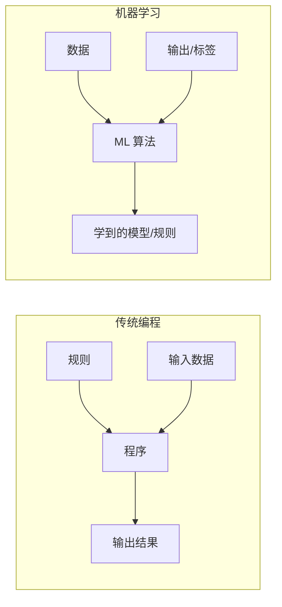

## 什么是机器学习？

机器学习（Machine Learning，简称 ML）是人工智能的一个子领域，研究如何让计算机系统从**数据**中自动学习和改进，而无需显式地编写规则。

### Tom Mitchell 的形式化定义

1997 年，Tom Mitchell 在其经典教材《Machine Learning》中给出了一个被广泛引用的定义：

> 对于一个计算机程序，如果它在某类任务 T 上的性能（由性能度量 P 衡量）随着经验 E 的增加而不断提升，则称该程序从经验 E 中学习了任务 T。

我们可以用三个要素来理解这一定义：

- **任务（Task，T）**：程序需要完成的事情，例如识别图像中的猫。
- **经验（Experience，E）**：程序接触到的数据，例如带标签的猫图片。
- **性能度量（Performance，P）**：衡量程序做得好不好的指标，例如分类准确率。

一个具体的例子：一个垃圾邮件过滤器 ——
- **T**：将邮件分类为"垃圾邮件"或"正常邮件"
- **E**：用户标记过的历史邮件
- **P**：正确识别的垃圾邮件比例

随着用户不断标记更多邮件（E 增加），过滤器应当变得越来越准确（P 提升）。

### 传统编程 vs 机器学习

理解机器学习最直观的方式，是将其与传统编程进行对比：



在传统编程中，程序员手工编写规则，程序根据规则处理输入得到输出。当规则复杂（如图像识别）或频繁变化（如反欺诈规则）时，手工编写规则变得极其困难甚至不可行。

在机器学习范式中，我们提供**输入数据和期望的输出**，由算法自动发现规则和模式。这就像教一个孩子认识猫——你不会写一本"猫的特征手册"让孩子背诵，而是指着一张张猫的图片说"这是猫"，孩子自己归纳出"猫长什么样"的模式。

## 机器学习简史

机器学习并非一夜之间诞生的，它经历了几十年的起伏发展：

### 感知机时代（1958）

1958 年，Frank Rosenblatt 发明了**感知机（Perceptron）**，这是第一个可以从数据中学习的人工神经网络模型。感知机能够解决简单的线性可分问题（如 AND、OR 逻辑门），引发了第一波人工智能热潮。但在 1969 年，Marvin Minsky 和 Seymour Papert 证明了感知机无法解决 XOR 问题，这一发现导致神经网络研究进入低谷。

### AI 寒冬（1970s - 1980s）

由于早期对 AI 能力的过度宣传与实际成果之间的巨大差距，加上当时计算能力和数据的限制，人工智能研究进入了所谓的"AI 寒冬"。在此期间，研究资金大幅削减，进展缓慢。不过，一些重要的工作仍在继续——如 J.R. Quinlan 的决策树算法（ID3）和后向传播算法的理论研究。

### 统计学习兴起（1990s - 2000s）

随着计算能力的提升和数据量的增长，统计学习方法开始占据主导地位。支持向量机（SVM，1995）、AdaBoost（1995）、随机森林（2001）等算法相继提出并取得了优秀的实际效果。这个时期的 ML 更加注重数学基础和泛化理论。

### 深度学习革命（2010s 至今）

2012 年，AlexNet 在 ImageNet 图像识别大赛中以压倒性优势夺冠，标志着深度学习时代的全面到来。此后，卷积神经网络（CNN）在计算机视觉领域、循环神经网络（RNN）和后来的 Transformer 在自然语言处理领域相继取得突破性进展。2016 年 AlphaGo 击败李世石，2022 年 ChatGPT 横空出世，机器学习正在深刻改变人类社会的方方面面。

## 机器学习的现实应用

机器学习已经渗透到日常生活的各个角落：

| 领域 | 应用案例 | 常见方法 |
|------|----------|----------|
| **推荐系统** | 抖音推荐视频、淘宝推荐商品、豆瓣推荐电影 | 协同过滤、深度学习 |
| **自然语言处理** | 机器翻译、智能客服、文本摘要 | Transformer、序列模型 |
| **计算机视觉** | 人脸解锁、医学影像分析、自动驾驶感知 | CNN、目标检测模型 |
| **语音技术** | 语音助手（Siri/小爱）、语音输入法 | RNN、CTC、Whisper |
| **金融风控** | 信用卡欺诈检测、信用评分 | 异常检测、集成学习 |
| **医疗健康** | 疾病诊断辅助、药物发现、基因分析 | 分类模型、图神经网络 |
| **自动驾驶** | 车道保持、行人检测、路径规划 | 多模态融合、强化学习 |

## 核心术语

在深入学习之前，我们需要建立一个术语词汇表：

### 数据相关

- **样本（Sample / Instance）**：数据中的一条记录。例如，一位患者的所有检查指标构成一个样本。
- **特征（Feature / Attribute）**：样本的某个可测量的属性。例如，患者的年龄、血压值、体温等。通常用 $x$ 表示，所有特征的向量记为 $\mathbf{x} = [x_1, x_2, \ldots, x_d]$。
- **标签（Label / Target）**：我们想要预测的目标值，通常用 $y$ 表示。在有监督学习中，每个训练样本都有一个对应的标签。
- **数据集（Dataset）**：一组样本的集合。通常记为 $\mathcal{D} = \{(\mathbf{x}_1, y_1), (\mathbf{x}_2, y_2), \ldots, (\mathbf{x}_n, y_n)\}$。

### 模型与学习相关

- **模型（Model）**：从输入到输出的映射函数，记为 $f(\mathbf{x})$ 或 $\hat{y} = f(\mathbf{x};\theta)$，其中 $\theta$ 是模型的参数。
- **训练（Training / Learning）**：利用数据调整模型参数 $\theta$ 的过程，目标是使模型的预测尽可能接近真实值。
- **推理（Inference / Prediction）**：用训练好的模型对新数据进行预测的过程。
- **损失函数（Loss Function）**：衡量模型预测 $\hat{y}$ 与真实标签 $y$ 之间差距的函数，记为 $\mathcal{L}(\hat{y}, y)$。例如，均方误差（MSE）$\mathcal{L} = \frac{1}{n}\sum_{i=1}^{n}(\hat{y}_i - y_i)^2$。
- **优化器（Optimizer）**：用于更新模型参数以最小化损失函数的算法，最常见的是梯度下降及其变体（SGD、Adam 等）。

### 学习范式初步

- **监督学习（Supervised Learning）**：训练数据包含标签。目标是学习从输入到输出的映射。
- **无监督学习（Unsupervised Learning）**：训练数据没有标签。目标是从数据中发现隐藏的结构和模式。
- **强化学习（Reinforcement Learning）**：智能体（Agent）在环境（Environment）中通过试错来学习最优策略。

## 一个简单的 Python 示例

让我们用 scikit-learn 来感受一下机器学习的基本流程——在 Iris 数据集上训练一个分类器：

```python
import numpy as np
from sklearn.datasets import load_iris
from sklearn.model_selection import train_test_split
from sklearn.tree import DecisionTreeClassifier
from sklearn.metrics import accuracy_score

# 1. 加载数据
iris = load_iris()
X, y = iris.data, iris.target
print(f"特征数量: {X.shape[1]}, 样本数量: {X.shape[0]}")
print(f"类别: {iris.target_names}")

# 2. 划分数据集
X_train, X_test, y_train, y_test = train_test_split(
    X, y, test_size=0.2, random_state=42
)
print(f"训练集大小: {len(X_train)}, 测试集大小: {len(X_test)}")

# 3. 创建并训练模型
model = DecisionTreeClassifier(max_depth=3, random_state=42)
model.fit(X_train, y_train)

# 4. 评估
y_pred = model.predict(X_test)
accuracy = accuracy_score(y_test, y_pred)
print(f"测试准确率: {accuracy:.2%}")

# 5. 对新数据进行推理
new_sample = np.array([[5.1, 3.5, 1.4, 0.2]])
prediction = model.predict(new_sample)
print(f"新样本预测类别: {iris.target_names[prediction[0]]}")
```

这短短几行代码已经包含了机器学习的核心循环：**加载数据 -> 划分数据 -> 训练模型 -> 评估模型 -> 使用模型**。在后续课程中，我们将逐步深入理解每一个步骤背后的原理。

## 本节小结

- 机器学习让计算机从数据中自动发现模式，而不需要手工编程规则。
- Tom Mitchell 用任务(T)、经验(E)、性能(P)三个要素精确定义了什么是"学习"。
- 机器学习经历了感知机时代的希望、AI 寒冬的低谷、统计学习的复兴和深度学习的革命。
- 特征、标签、模型、训练、推理、损失函数是理解 ML 的核心术语。
- 监督学习、无监督学习、强化学习是机器学习的三大主要范式。

在下一课中，我们将详细拆解各种学习类型的特点和适用场景。
