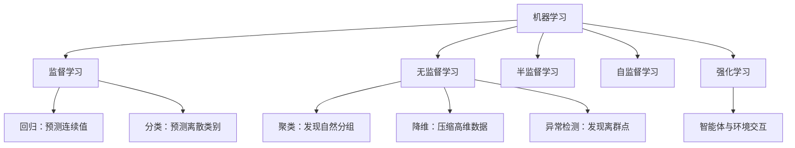
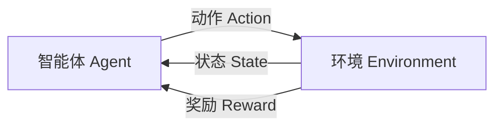
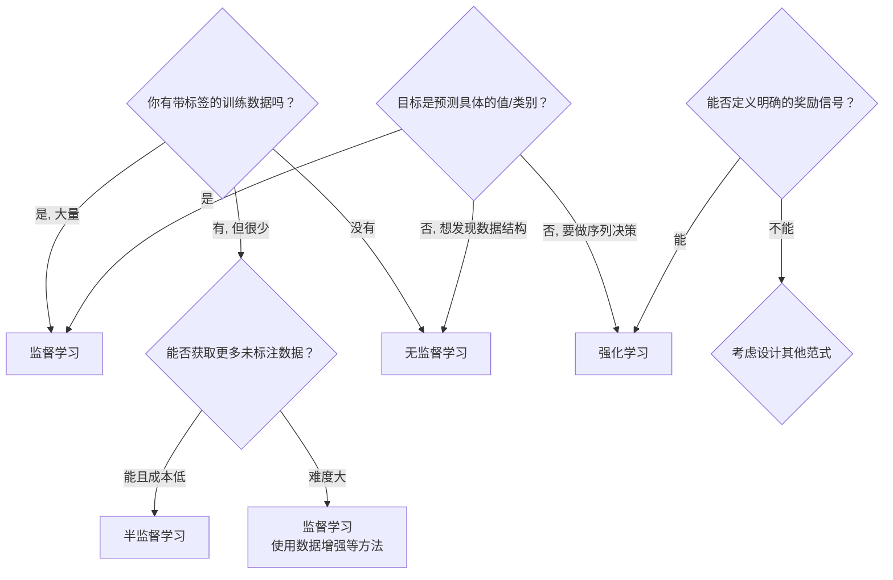

## 机器学习的五大类型

根据训练数据的性质和学习目标的不同，机器学习可以分为多种类型。理解每种类型的特点和适用场景，是选择正确方法的第一步。



## 一、监督学习（Supervised Learning）

监督学习是目前应用最广泛、研究最成熟的机器学习范式。核心特征是：**训练数据中的每一个样本都有对应的标签（正确答案）**。

形式化地，训练数据为 $\mathcal{D} = \{(\mathbf{x}_1, y_1), (\mathbf{x}_2, y_2), \ldots, (\mathbf{x}_n, y_n)\}$，我们的目标是学习一个映射函数 $f: \mathbf{x} \rightarrow y$。

### 1.1 回归（Regression）

当目标变量 $y$ 是**连续的数值**时，我们面对的是一个回归问题。

**典型例子：**
- 根据房屋面积、楼层、位置等因素预测房价
- 根据历史气温预测明天的温度
- 根据广告投入预测产品销量

**常用算法：** 线性回归、多项式回归、岭回归、Lasso、决策树回归、随机森林回归、神经网络回归

**评估指标：** 均方误差（MSE = $\frac{1}{n}\sum_{i=1}^{n}(\hat{y}_i - y_i)^2$）、平均绝对误差（MAE）、$R^2$ 得分

```python
from sklearn.linear_model import LinearRegression
from sklearn.datasets import fetch_california_housing

# 回归示例：加州房价预测
data = fetch_california_housing()
X, y = data.data, data.target
print(f"目标变量范围: [{y.min():.2f}, {y.max():.2f}]")  # 连续值

model = LinearRegression()
model.fit(X[:15000], y[:15000])
predictions = model.predict(X[15000:])
print(f"前5个预测结果: {predictions[:5]}")  # 连续数值
```

### 1.2 分类（Classification）

当目标变量 $y$ 属于**有限的离散类别**时，我们面对的是一个分类问题。

**二分类 vs 多分类：**
- **二分类**：$y \in \{0, 1\}$，例如判断邮件是否为垃圾邮件
- **多分类**：$y \in \{1, 2, \ldots, K\}$，例如手写数字识别（0-9）
- **多标签分类**：一个样本可以同时属于多个类别，例如一篇新闻可以同时标记为"体育"和"国际"

**常用算法：** 逻辑回归、决策树、随机森林、支持向量机（SVM）、K 近邻（KNN）、朴素贝叶斯、神经网络

**评估指标：** 准确率、精确率、召回率、F1 分数、AUC-ROC 曲线

```python
from sklearn.linear_model import LogisticRegression
from sklearn.datasets import load_digits
from sklearn.model_selection import train_test_split
from sklearn.metrics import classification_report

# 分类示例：手写数字识别（10类）
digits = load_digits()
X_train, X_test, y_train, y_test = train_test_split(
    digits.data, digits.target, test_size=0.3, random_state=42
)

model = LogisticRegression(max_iter=5000)
model.fit(X_train, y_train)
y_pred = model.predict(X_test)

print(classification_report(y_test, y_pred, target_names=digits.target_names.astype(str)))
```

### 回归 vs 分类：边界情况

有时回归和分类的界限是模糊的。例如：
- 将年龄预测（回归）离散化为年龄段（分类）：儿童、青少年、青年、中年、老年
- 天气预测可以是回归（温度数值），也可以是分类（晴/阴/雨）
- 逻辑回归虽然名字带"回归"，但本质上是一个分类算法——它通过 sigmoid 函数将连续输出映射到 $[0,1]$ 区间作为概率

理解你的业务目标：你需要的是一个精确的数值，还是只需要区分不同类别？答案决定了你该选择回归还是分类。

## 二、无监督学习（Unsupervised Learning）

当训练数据**没有标签**时，我们进入无监督学习的领域。目标不是预测标签，而是发现数据中隐藏的结构、模式或分布特性。

### 2.1 聚类（Clustering）

将数据点按照相似性自动分组，使得同一组内的数据点尽可能相似，不同组之间尽可能不同。

**常用算法：**
- **K-Means**：最经典的聚类算法，迭代地将数据划分到 K 个簇中，目标是使簇内平方和最小
- **层次聚类（Hierarchical Clustering）**：自底向上或自顶向下构建聚类树
- **DBSCAN**：基于密度的聚类，可以自动发现任意形状的簇并识别噪声点
- **Gaussian Mixture Models（GMM）**：用多个高斯分布的混合来建模数据

**典型应用：**
- 客户分群（Customer Segmentation）：将用户按照消费行为分为不同群体
- 图像分割：将图像中的像素按相似性分组
- 文档聚类：按主题自动组织大量文档

```python
from sklearn.cluster import KMeans
import numpy as np

# 生成带有自然分组结构的数据
from sklearn.datasets import make_blobs
X, true_labels = make_blobs(n_samples=300, centers=4, random_state=42)

# K-Means 聚类
kmeans = KMeans(n_clusters=4, random_state=42, n_init='auto')
predicted_labels = kmeans.fit_predict(X)

print(f"聚类中心:\n{kmeans.cluster_centers_}")
print(f"各簇样本数: {np.bincount(predicted_labels)}")
```

### 2.2 降维（Dimensionality Reduction）

将高维数据映射到低维空间，同时尽量保留原始数据的重要信息。

**为什么需要降维？**
1. **可视化**：将 100 维数据降到 2-3 维以便可视化
2. **去噪**：去除不重要的维度（往往是噪声）
3. **加速计算**：更少的特征意味着更快的训练速度
4. **避免维度灾难**：高维空间中数据变得稀疏，距离度量失效

**主要方法：**
- **PCA（主成分分析）**：寻找方差最大的投影方向，线性降维
- **t-SNE**：保留局部邻域结构的非线性降维，适合可视化
- **UMAP**：比 t-SNE 更快，且能更好地保留全局结构
- **Autoencoder**：用神经网络学习的非线性降维

```python
from sklearn.decomposition import PCA
from sklearn.datasets import load_digits

digits = load_digits()
X = digits.data  # 64维（8x8像素）

# PCA 降维到 2 维
pca = PCA(n_components=2)
X_reduced = pca.fit_transform(X)

print(f"原始维度: {X.shape[1]}, 降维后维度: {X_reduced.shape[1]}")
print(f"保留的方差比例: {pca.explained_variance_ratio_.sum():.2%}")
```

### 2.3 异常检测（Anomaly Detection）

识别数据集中与大多数样本显著不同的"异常点"。这些异常点可能代表欺诈交易、设备故障、疾病信号等重要信息。

**方法：** 基于统计分布（如 Z-score）、孤立森林（Isolation Forest）、基于聚类距离、基于 Autoencoder 的重构误差等。

## 三、半监督学习（Semi-supervised Learning）

在许多现实场景中，获取标签是昂贵的：医生需要花时间标注医学图像，语言专家需要翻译和标注文本。而**无标签数据**往往唾手可得。

半监督学习利用**少量有标签数据 + 大量无标签数据**来训练模型。

**核心思想：** 无标签数据虽然不直接提供监督信号，但蕴含了数据的分布信息。例如，如果两个未标注的样本在特征空间中很接近，它们很可能属于同一类别。

**常见方法：**
- **自训练（Self-training）**：先在少量有标签数据上训练模型，然后对无标签数据进行预测，将高置信度的预测作为"伪标签"加入训练集，重复迭代
- **一致性正则化（Consistency Regularization）**：鼓励模型对同一输入的不同扰动版本给出相似预测
- **FixMatch**：结合伪标签和一致性正则化的现代半监督方法

**典型场景：** 医学图像标注（只有少数图有专家标注）、网页分类（海量网页只有极少数有标签）

## 四、自监督学习（Self-supervised Learning）

自监督学习是无监督学习的一种特殊形式，近年来在深度学习中极其重要（GPT 系列模型的基础训练方式）。核心思想是：**从数据本身设计一个"前置任务（Pretext Task）"，自动生成监督信号，模型的真正目标是学习数据的通用表示**。

**经典例子：**
- **掩码语言建模（Masked Language Modeling）**：随机遮住文本中的一些词，让模型预测被遮住的词。这就是 BERT 的训练方式。给定 "今天天气很 [MASK]" → 预测 "好"。
- **下一个句子预测（Next Sentence Prediction）**：给定两个句子，判断它们是否在原文中是相邻的。
- **对比学习（Contrastive Learning）**：让同一张图片的不同增强版本（裁剪、翻转等）在表示空间中靠近，不同图片的表示远离（如 SimCLR、MoCo）。
- **自回归语言建模**：给定前文，预测下一个词。这是 GPT 系列的核心训练目标。数学上，建模 $P(w_t | w_1, w_2, \ldots, w_{t-1})$。

自监督学习的重要性在于：它使得模型可以从海量无标签数据（互联网文本、图片）中学习到强大的通用表示，然后只需少量有标签数据即可微调适应下游任务。这也是 **"预训练 + 微调"** 范式的核心。

## 五、强化学习（Reinforcement Learning）

强化学习（RL）是机器学习中一个独特且重要的范式。它与监督学习的关键区别在于：**没有"标准答案"告诉你每个动作是正确的还是错误的，只有延迟的奖励信号**。

### 核心要素



- **智能体（Agent）**：学习和做决策的主体，如 AlphaGo、自动驾驶车辆
- **环境（Environment）**：智能体所处的外部世界，智能体在其中执行动作
- **状态（State，$s$）**：环境在某一时刻的完整描述
- **动作（Action，$a$）**：智能体可以执行的操作
- **奖励（Reward，$r$）**：环境对动作的即时反馈（正 = 好，负 = 坏）
- **策略（Policy，$\pi$）**：智能体的决策规则，即在每个状态下选择什么动作。$\pi(a|s)$ 表示在状态 $s$ 下选择动作 $a$ 的概率
- **价值函数（Value Function，$V(s)$）**：从状态 $s$ 开始，按照策略 $\pi$ 行动所能获得的期望累积奖励

### 与监督学习的本质区别

| 维度 | 监督学习 | 强化学习 |
|------|----------|----------|
| 反馈时机 | 每个样本都有即时正确答案 | 延迟的奖励信号 |
| 数据来源 | 静态的固定数据集 | 智能体与环境的实时交互 |
| 目标 | 学习输入到输出的映射 | 学习最大化长期累积奖励的策略 |
| 探索 vs 利用 | 不涉及 | 核心矛盾：尝试新动作 vs 使用已知最优动作 |

### 经典应用

- AlphaGo / AlphaZero 击败人类围棋冠军
- 机器人控制：步行、抓取物体
- 大语言模型的人类偏好对齐（RLHF）
- 自动驾驶中的决策规划
- 游戏 AI：Atari 游戏、Dota 2、星际争霸

```python
# 强化学习的基本交互循环（伪代码示意）
state = env.reset()
for step in range(max_steps):
    action = agent.select_action(state)      # 根据策略选择动作
    next_state, reward, done, _ = env.step(action)  # 执行动作，得到奖励和下一状态
    agent.learn(state, action, reward, next_state)  # 从经验中学习
    state = next_state
    if done:
        break
```

## 选择哪种类型：决策指南

面对一个实际问题，如何选择合适的学习范式？以下是决策流程：



**快速判断法则：**
1. 有标签 + 需预测数值 → **回归**
2. 有标签 + 需预测类别 → **分类**
3. 无标签 + 需找分组 → **聚类**
4. 无标签 + 需压缩维度 → **降维**
5. 序列决策 + 有反馈 → **强化学习**
6. 有少量标签 + 大量无标签 → **半监督学习**

## 本节小结

- 监督学习要求有标签数据，分为回归（连续值）和分类（离散值）两大类。
- 无监督学习不需要标签，主要包括聚类、降维和异常检测。
- 半监督学习利用少量有标签数据和大量无标签数据，在标注成本高的场景中尤为实用。
- 自监督学习通过设计前置任务从数据本身自动生成监督信号，是预训练-微调范式的基础。
- 强化学习通过智能体与环境的交互来学习最优策略，适用于序列决策问题。
- 选择 ML 类型的关键是：数据是否有标签、目标是什么、反馈如何获得。
