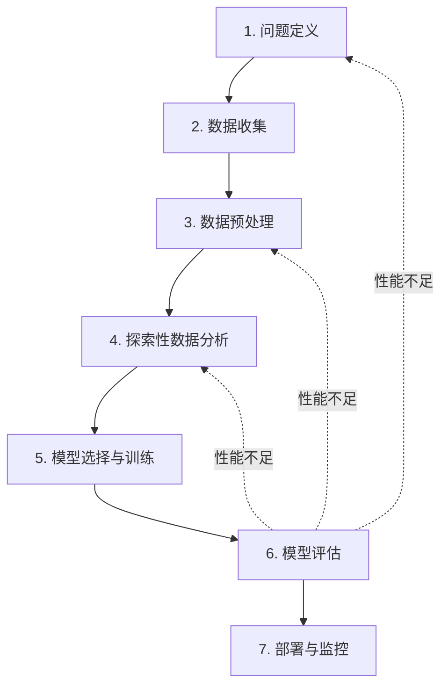

## 机器学习的七步工作流程

机器学习项目远不止调用 `model.fit()` 这么简单。一个成功的 ML 项目需要遵循系统化的流程，每个步骤都有其独特的目的和需要注意的陷阱。



注意流程中的回退箭头：机器学习是一个**迭代过程**，很少能一步到位。评估阶段的发现常常会引导你回到问题定义、数据处理或特征工程阶段。

---

## 第一步：问题定义（Problem Definition）

这是整个项目中最重要却最容易被忽视的一步。在写任何代码之前，你必须清晰地回答以下问题：

### 将业务问题转化为 ML 问题

| 业务问题 | ML 问题 | 任务类型 |
|----------|---------|----------|
| "我们应该批准这笔贷款吗？" | 预测贷款是否会违约 | 二分类 |
| "这个月的销售额会是多少？" | 预测下月销售额 | 回归 |
| "如何自动回复客服邮件？" | 邮件按意图分类 | 多分类 |
| "哪些用户可能取消订阅？" | 预测用户流失概率 | 二分类 |
| "如何优化仓库布局？" | 按购买模式对商品聚类 | 聚类 |
| "怎样给用户推荐新歌？" | 预测用户对歌曲的偏好分数 | 推荐 / 回归 |

### 评估可行性：在开始之前

```
核心问题清单：
[ ] 这个问题用 ML 解决真的比简单规则更好吗？
[ ] 我们有足够的数据吗？通常至少需要几百到几千个样本
[ ] 数据质量如何？有可靠的标签吗？
[ ] 模型预测出错会有什么后果？（医疗 vs 电影推荐，后果完全不同）
[ ] 如何衡量模型在实际业务中的成功？这一指标和数据科学指标可能不同
[ ] 有现成的解决方案或基线吗？
```

### 常见陷阱

- **为用 ML 而用 ML**：当几条 if-else 规则就能解决问题时，ML 可能带来不必要的复杂度
- **目标太模糊**：目标是"提升用户体验"，这无法被量化衡量。更好的目标是"将搜索点击率提升 2%"
- **忽略约束条件**：模型需要多快做出预测？可以消耗多少计算资源？延迟敏感场景中，大模型可能不可行

---

## 第二步：数据收集（Data Collection）

数据是 ML 项目的燃料。没有足够的高质量数据，最先进的算法也无能为力。

### 数据来源

| 来源类型 | 示例 | 注意事项 |
|----------|------|----------|
| **内部数据库** | 用户行为日志、交易记录 | 可能有格式不一致、字段含义模糊的问题 |
| **公开数据集** | Kaggle、UCI、OpenML、政府开放数据 | 质量参差不齐，需验证 |
| **第三方 API** | 气象数据、金融数据、社交媒体 | 有调用频率限制和成本 |
| **传感器 / IoT** | 温度、压力、视频流 | 可能有时序缺失和异常值 |
| **人工标注** | 图像分类标注、文本情感标注 | 成本高，需多标注者确保一致性 |
| **数据增强** | 图像旋转、文本回译 | 低成本扩大数据集的有效手段 |

### 数据量与质量

一个常见的误解是"数据越多越好"。实际上：

- **质量 > 数量**：1000 个干净准确的样本比 10000 个充满噪声的样本更有价值
- **多样性 > 总量**：训练数据应当覆盖部署时可能遇到的各种场景
- **经验法则**：特征数量的 10 倍以上的样本数是一个较安全的起点（对于传统 ML）

---

## 第三步：数据预处理（Data Preprocessing）

现实世界的数据几乎总是"脏"的。这一步的目标是将原始数据转化为模型可以使用的干净格式。常见任务包括：

- 处理缺失值（删除或填充）
- 处理异常值
- 编码类别变量（One-Hot / Label Encoding）
- 特征缩放（标准化 / 归一化）
- 特征工程（创建更有信息量的新特征）
- 文本清洗（分词、去停用词等）

> 详细的数据预处理技术将在**第 4 课**中深入讲解。

---

## 第四步：探索性数据分析（Exploratory Data Analysis，EDA）

EDA 是 ML 项目的"侦察兵"，帮助你在建模之前深入理解数据。**永远不要在理解数据之前开始建模**。

### EDA 的核心任务

1. **描述性统计**：了解每个特征的均值、方差、分位数、范围
2. **检查数据分布**：标签是否平衡？特征是否符合预期分布？
3. **发现异常值**：哪些数据点偏离正常范围？
4. **检查特征间的关系**：哪些特征高度相关？有没有共线性问题？
5. **特征与标签的关系**：哪些特征对预测目标最有影响力？

```python
import pandas as pd
import seaborn as sns
import matplotlib.pyplot as plt

# 加载数据
df = pd.read_csv("your_data.csv")

# 基础信息
print("=== 数据基本信息 ===")
print(f"形状: {df.shape}")
print(f"数据类型:\n{df.dtypes}")
print(f"缺失值:\n{df.isnull().sum()}")

# 描述性统计
print(f"\n=== 数值特征的描述性统计 ===")
print(df.describe())

# 查看标签分布
sns.countplot(data=df, x='target_column')
plt.title("标签分布")
plt.show()

# 相关性矩阵
sns.heatmap(df.corr(numeric_only=True), annot=True, cmap='coolwarm', center=0)
plt.title("特征相关性矩阵")
plt.show()
```

### 常见陷阱

- **跳过 EDA 直接建模**：数据中的严重问题（如 80% 的缺失值、标签严重不平衡）会让任何模型都表现不佳
- **EDA 只做一遍**：每次数据清洗后都应重新做 EDA，因为数据质量在变化
- **只看数值统计不看可视化**：Anscombe's quartet 告诉我们，统计量完全相同的数据可能具有截然不同的分布形态

---

## 第五步：模型选择与训练（Model Selection & Training）

### 如何选择模型？

没有一个模型能在所有问题上表现最好（这是"No Free Lunch"定理的核心含义）。选择模型时考虑：

- **任务类型**：回归选回归模型、分类选分类模型
- **数据规模**：数据量小 → 简单模型（避免过拟合），数据量大 → 可尝试复杂模型
- **可解释性需求**：金融、医疗领域可能需要可解释的模型（如线性回归、决策树），而非黑盒模型
- **训练/推理速度**：线上实时预测需要轻量模型

### 一般策略

从一个**简单的基线模型**开始，然后逐步尝试更复杂的方法：

```
起点：简单模型（线性回归、朴素贝叶斯）
  ↓ 评估性能
进阶：非线性模型（决策树、随机森林、XGBoost）
  ↓ 评估性能
高阶：深度学习（如果数据量足够大且问题有足够复杂度）
```

### 超参数调优

大多数模型有**超参数**（如决策树的深度、SVM 的 C 值），需要在训练之前设定。常见调优方法：

- **网格搜索（Grid Search）**：遍历指定的参数组合
- **随机搜索（Random Search）**：从参数空间中随机采样（通常更高效）
- **贝叶斯优化**：利用先前的评估结果智能选择下一组参数

---

## 第六步：模型评估（Model Evaluation）

**训练集上的性能和测试集上的性能是两回事。** 较低的测试性能说明模型可能过拟合。

### 评估策略

- **留出法（Hold-out）**：划分训练/验证/测试集，简单常用
- **交叉验证（Cross-Validation）**：K 折交叉验证，更稳健
- **分层抽样**：确保各集合中的类别比例与总体一致

### 评估指标

根据问题类型选择正确的指标：

| 问题类型 | 推荐指标 |
|----------|----------|
| 二分类（平衡） | Accuracy, F1-score |
| 二分类（不平衡） | Precision, Recall, AUC-ROC, F1-score |
| 多分类 | Macro/Micro F1-score |
| 回归 | MSE, MAE, R-squared, MAPE |

> 详细的模型评估方法将在**第 5 课**中深入讲解。

---

## 第七步：部署与监控（Deployment & Monitoring）

模型训练完成并通过评估后，你需要将其部署到生产环境，并持续监控其表现。

### 部署方式

| 方式 | 适用场景 |
|------|----------|
| **REST API** | 按需调用（如信用卡欺诈检测） |
| **批处理** | 定期批量预测（如每日用户推荐更新） |
| **嵌入式** | 在边缘设备上运行（如手机端人脸识别） |

### 监控要点

- **数据漂移（Data Drift）**：输入数据的分布随时间变化（如新冠后消费模式剧变）
- **概念漂移（Concept Drift）**：输入-输出的关系发生变化（如欺诈模式随反欺诈系统升级而演变）
- **模型衰退**：模型性能随时间的衰减

### MLOps 简述

MLOps（Machine Learning Operations）是 DevOps 在 ML 领域的延伸，涵盖模型版本管理、自动化再训练、A/B 测试、模型性能监控等实践。

---

## 端到端实战：Iris 数据集

下面通过 Iris（鸢尾花）数据集演示一个完整的 ML 工作流。Iris 是一个非常经典的入门数据集，包含 150 个样本，4 个特征（花萼长宽、花瓣长宽），3 个类别（Setosa、Versicolor、Virginica）。

```python
# ============================================================
# 完整 ML 工作流：Iris 花卉分类
# ============================================================
import numpy as np
import pandas as pd
from sklearn.datasets import load_iris
from sklearn.model_selection import train_test_split, cross_val_score, GridSearchCV
from sklearn.preprocessing import StandardScaler
from sklearn.tree import DecisionTreeClassifier
from sklearn.ensemble import RandomForestClassifier
from sklearn.linear_model import LogisticRegression
from sklearn.metrics import classification_report, confusion_matrix, accuracy_score
import matplotlib.pyplot as plt
import seaborn as sns

# -------------------------------------------------------
# 步骤 1: 问题定义
# -------------------------------------------------------
# 业务问题: 如何根据花朵的物理尺寸自动识别鸢尾花品种？
# ML 问题: 4个特征 → 3个类别 的多分类问题
# 评估指标: 准确率（类别较平衡）

# -------------------------------------------------------
# 步骤 2: 数据收集
# -------------------------------------------------------
iris = load_iris()
print(f"特征名称: {iris.feature_names}")
print(f"类别名称: {iris.target_names}")
print(f"数据形状: {iris.data.shape}")

# 转换为 DataFrame 以便分析
df = pd.DataFrame(iris.data, columns=iris.feature_names)
df['species'] = pd.Categorical.from_codes(iris.target, iris.target_names)
print(f"\n前5行数据:\n{df.head()}")
print(f"\n各类别样本数:\n{df['species'].value_counts()}")

# -------------------------------------------------------
# 步骤 3 & 4: 数据预处理 & EDA
# -------------------------------------------------------
# 检查缺失值
print(f"\n缺失值统计:\n{df.isnull().sum()}")

# 描述性统计
print(f"\n描述性统计:\n{df.describe()}")

# 可视化 - 类别分布
plt.figure(figsize=(12, 4))
plt.subplot(1, 2, 1)
sns.countplot(data=df, x='species', palette='viridis')
plt.title('Iris 类别分布')

# 可视化 - 特征之间的关系
plt.subplot(1, 2, 2)
sns.heatmap(df.iloc[:, :4].corr(), annot=True, cmap='coolwarm', center=0)
plt.title('特征相关性矩阵')
plt.tight_layout()
plt.savefig('iris_eda.png', dpi=100, bbox_inches='tight')
plt.close()

# -------------------------------------------------------
# 步骤 5: 数据准备
# -------------------------------------------------------
X = iris.data
y = iris.target

# 划分训练集和测试集（80/20，分层抽样保持类别比例）
X_train, X_test, y_train, y_test = train_test_split(
    X, y, test_size=0.2, random_state=42, stratify=y
)
print(f"\n训练集大小: {len(X_train)}, 测试集大小: {len(X_test)}")
print(f"训练集类别分布: {np.bincount(y_train)}")

# 特征缩放（标准化）
scaler = StandardScaler()
X_train_scaled = scaler.fit_transform(X_train)
X_test_scaled = scaler.transform(X_test)  # 注意: 用训练集的参数来 transform 测试集

# -------------------------------------------------------
# 步骤 5（续）: 模型选择与训练
# -------------------------------------------------------
# 试多个模型，比较基线性能
models = {
    "Logistic Regression": LogisticRegression(max_iter=1000, random_state=42),
    "Decision Tree": DecisionTreeClassifier(max_depth=4, random_state=42),
    "Random Forest": RandomForestClassifier(n_estimators=100, random_state=42),
}

print("\n=== 模型比较 ===")
for name, model in models.items():
    # 5-折交叉验证
    cv_scores = cross_val_score(model, X_train_scaled, y_train, cv=5)
    print(f"{name}: CV Accuracy = {cv_scores.mean():.3f} (+/-{cv_scores.std() * 2:.3f})")

# 选择表现最好的模型进行超参数调优
print("\n=== 超参数调优: 随机森林 ===")
param_grid = {
    'n_estimators': [50, 100, 200],
    'max_depth': [3, 5, 7, None],
    'min_samples_split': [2, 5, 10],
}
grid_search = GridSearchCV(
    RandomForestClassifier(random_state=42),
    param_grid, cv=5, scoring='accuracy', n_jobs=-1
)
grid_search.fit(X_train_scaled, y_train)
print(f"最佳参数: {grid_search.best_params_}")
print(f"最佳交叉验证分数: {grid_search.best_score_:.4f}")

# -------------------------------------------------------
# 步骤 6: 模型评估
# -------------------------------------------------------
best_model = grid_search.best_estimator_
y_pred = best_model.predict(X_test_scaled)

print("\n=== 最终评估（测试集）===")
print(f"测试准确率: {accuracy_score(y_test, y_pred):.4f}")
print(f"\n分类报告:\n{classification_report(y_test, y_pred, target_names=iris.target_names)}")

# 混淆矩阵
cm = confusion_matrix(y_test, y_pred)
plt.figure(figsize=(6, 5))
sns.heatmap(cm, annot=True, fmt='d', cmap='Blues',
            xticklabels=iris.target_names,
            yticklabels=iris.target_names)
plt.xlabel('预测类别')
plt.ylabel('真实类别')
plt.title('混淆矩阵')
plt.tight_layout()
plt.savefig('iris_confusion_matrix.png', dpi=100, bbox_inches='tight')
plt.close()

# 特征重要性
feature_importance = pd.DataFrame({
    'feature': iris.feature_names,
    'importance': best_model.feature_importances_
}).sort_values('importance', ascending=False)

print(f"\n特征重要性:\n{feature_importance}")

# -------------------------------------------------------
# 步骤 7: 部署准备（保存模型）
# -------------------------------------------------------
import joblib
joblib.dump(best_model, 'iris_model.pkl')
joblib.dump(scaler, 'iris_scaler.pkl')
print("\n模型和 scaler 已保存。")

# 模拟推理: 对新样本进行预测
new_flower = np.array([[5.1, 3.5, 1.4, 0.2]])  # 典型 Setosa
new_flower_scaled = scaler.transform(new_flower)
prediction = best_model.predict(new_flower_scaled)
proba = best_model.predict_proba(new_flower_scaled)

print(f"\n=== 新样本推理 ===")
print(f"预测类别: {iris.target_names[prediction[0]]}")
for i, class_name in enumerate(iris.target_names):
    print(f"  {class_name}: {proba[0, i]:.3%}")
```

### 工作流回顾

通过上述端到端示例，我们可以看到七个步骤如何有机配合：

1. 我们从**问题定义**开始：这是一个 4 特征到 3 类别的多分类问题
2. **数据收集**使用了 sklearn 内置的 Iris 数据集
3. **预处理**包括检查缺失值和标准化
4. **EDA**帮助我们了解特征分布和类别平衡情况
5. **模型训练**中我们比较了多个模型，并通过网格搜索调优
6. **评估**使用了独立测试集，输出了分类报告和混淆矩阵
7. 模型和预处理器被**保存**，可以进行推理

### 各步骤的常见陷阱总结

| 步骤 | 常见陷阱 |
|------|----------|
| 问题定义 | 目标模糊、忽略业务约束、ML 并非最优解 |
| 数据收集 | 样本有偏（不代表真实分布）、标签噪声大 |
| 数据预处理 | 数据泄露（用测试集信息处理训练集） |
| EDA | 只看数据不看图、忽略异常值 |
| 模型训练 | 默认参数、过早尝试复杂模型 |
| 模型评估 | 只看训练准确率、指标选取不当 |
| 部署监控 | 忽略环境变化、缺少回滚预案 |

## 本节小结

- ML 项目遵循"问题定义 → 数据收集 → 数据预处理 → EDA → 模型训练 → 评估 → 部署"的七步流程
- 流程是迭代的，评估结果不好时需回溯到前面的步骤调整
- 问题定义是最重要的一步：将业务问题转化为合适的 ML 任务
- 从一个简单的基线模型开始，渐进式提升复杂度
- 数据质量和领域理解比算法选择更重要
- 部署只是开始，持续监控模型表现是确保长期价值的关键
