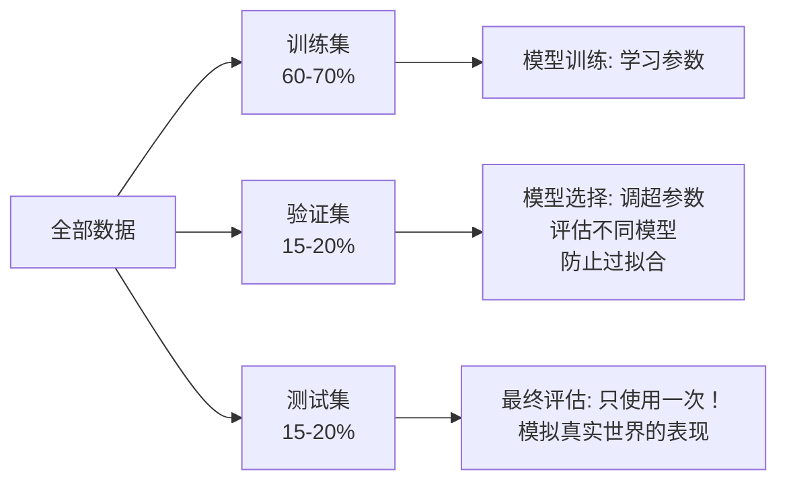

## 为什么数据预处理至关重要？

现实世界的数据是"脏"的——缺失值、量纲不统一、非数值类别、噪声、异常值……这些问题如果不经处理就输入模型，轻则降低性能，重则导致模型完全无法工作。一句在数据科学界广为流传的话是：

> Garbage in, garbage out.（垃圾进，垃圾出。）

数据预处理通常占据 ML 项目 **60%-80% 的时间**。它不像模型调参那样炫酷，但往往是决定项目成败的关键。

---

## 一、处理缺失值（Handling Missing Values）

缺失值是几乎所有真实数据集中都会出现的问题。调查问卷中有人跳过了某些问题，传感器故障导致数据点丢失，数据库迁移时字段被遗漏……需要谨慎处理。

### 1.1 先理解"缺失"的原因

在处理缺失值之前，首先要分析缺失的原因——不同类型的缺失需要不同的处理策略：

| 缺失类型 | 含义 | 示例 |
|----------|------|------|
| **完全随机缺失（MCAR）** | 缺失与任何数据都无关 | 设备随机偶发故障 |
| **随机缺失（MAR）** | 缺失与其他可观测变量有关 | 老年患者更可能跳过运动量调查 |
| **非随机缺失（MNAR）** | 缺失与缺失值本身有关 | 高收入者更不愿意透露收入 |

例如，在收入调查中，"不回答"这一行为本身可能意味着高收入——盲目删除这些样本会引入严重偏差。

### 1.2 处理策略

**策略 1：删除（Deletion）**

```python
import pandas as pd
import numpy as np

df = pd.DataFrame({
    'A': [1, 2, np.nan, 4],
    'B': [5, np.nan, np.nan, 8],
    'C': [9, 10, 11, 12]
})

print(f"原始数据:\n{df}")

# 删除含有任何缺失值的行
df_dropna_rows = df.dropna()
print(f"\n删除含缺失值的行后:\n{df_dropna_rows}")

# 删除含有任何缺失值的列
df_dropna_cols = df.dropna(axis=1)
print(f"\n删除含缺失值的列后:\n{df_dropna_cols}")

# 只有当缺失值超过阈值(如50%)时才删除该列
threshold = len(df) * 0.5
df_thresh = df.dropna(axis=1, thresh=threshold)
print(f"\n阈值法(>50%非空)后:\n{df_thresh}")
```

**何时使用删除：**
- 缺失比例很小（< 5%），样本量充足
- 缺失完全随机（MCAR）
- 缺失列的信息可以从其他特征中获取

**策略 2：简单填充（Simple Imputation）**

```python
from sklearn.impute import SimpleImputer

df = pd.DataFrame({
    'age': [25, 30, np.nan, 35, 28],
    'income': [50000, 60000, 75000, np.nan, 55000],
    'category': ['A', 'B', np.nan, 'A', 'B']
})

# 数值特征：均值 / 中位数 / 常数填充
imputer_mean = SimpleImputer(strategy='mean')
imputer_median = SimpleImputer(strategy='median')
imputer_constant = SimpleImputer(strategy='constant', fill_value=0)

numeric_cols = ['age', 'income']
df_numeric = df[numeric_cols].copy()

# 均值填充
df_mean = pd.DataFrame(
    imputer_mean.fit_transform(df_numeric),
    columns=numeric_cols
)
print(f"均值填充:\n{df_mean}")

# 中位数填充（对异常值更鲁棒）
df_median = pd.DataFrame(
    imputer_median.fit_transform(df_numeric),
    columns=numeric_cols
)
print(f"\n中位数填充:\n{df_median}")

# 类别特征：众数填充
from sklearn.impute import SimpleImputer as CatImputer
# 对于类别特征，使用策略 'most_frequent'
```

**填充策略选择指南：**
- **均值**：数据近似正态分布时使用（价格、温度、考试成绩）
- **中位数**：当存在异常值时更鲁棒（收入、房屋面积）
- **众数**：适用于类别特征（颜色、品牌、城市）

**策略 3：高级填充**
- **KNN 填充**：使用 K 个最近邻的均值或众数填充
- **回归填充**：用其他特征构建回归模型预测缺失值
- **多重插补（Multiple Imputation）**：多次填充并聚合结果，反映不确定性
- **指示变量**：添加一个二值特征指示"该值是否原本缺失"（有时缺失本身包含预测信号）

```python
# KNN 插补示例
from sklearn.impute import KNNImputer

knn_imputer = KNNImputer(n_neighbors=3)
df_knn = pd.DataFrame(
    knn_imputer.fit_transform(df_numeric),
    columns=numeric_cols
)
print(f"KNN填充(3近邻):\n{df_knn}")
```

---

## 二、特征缩放（Feature Scaling）

当不同特征的量纲差异巨大时（如"收入"以万计而"年龄"以十计），大多数基于距离或梯度的算法会表现不佳。特征缩放将所有特征放到可比较的尺度上。

### 2.1 标准化（Standardization / Z-score Normalization）

将特征转换为均值为 0、标准差为 1 的分布：

$$x_{\text{standardized}} = \frac{x - \mu}{\sigma}$$

其中 $\mu$ 是特征均值，$\sigma$ 是特征标准差。

- **适用场景**：数据近似正态分布；使用梯度下降的模型（线性回归、逻辑回归、神经网络）；PCA；SVM
- **对异常值**：有一定敏感性（均值和标准差会被异常值影响）

### 2.2 归一化（Min-Max Normalization）

将特征线性缩放到 $[0, 1]$ 区间（或 $[-1, 1]$）：

$$x_{\text{normalized}} = \frac{x - x_{\min}}{x_{\max} - x_{\min}}$$

- **适用场景**：特征有明确的上下界；需要保持稀疏性的特征；图像像素值（0-255 → 0-1）；某些距离度量（如 KNN）
- **对异常值**：非常敏感——单个极端值会压缩其他所有值的范围

### 2.3 其他缩放方法

| 方法 | 公式 | 适用场景 |
|------|------|----------|
| **Robust Scaling** | $\frac{x - \text{median}}{\text{IQR}}$ | 有大量异常值的数据 |
| **MaxAbs Scaling** | $\frac{x}{\lvert x \rvert_{\max}}$ | 稀疏数据，需保持 0 值不变 |
| **Log Transform** | $\log(x + 1)$ | 长尾分布（如收入、点击量） |

### 代码对比

```python
import numpy as np
from sklearn.preprocessing import StandardScaler, MinMaxScaler, RobustScaler

# 构造示例数据（包含异常值）
np.random.seed(42)
data = np.random.normal(50, 15, 100).reshape(-1, 1)
data = np.vstack([data, [[200]]])  # 添加一个异常值
print(f"原始数据 - 范围: [{data.min():.1f}, {data.max():.1f}], "
      f"均值: {data.mean():.1f}, 标准差: {data.std():.1f}")

# 标准化
scaler_std = StandardScaler()
data_std = scaler_std.fit_transform(data)
print(f"标准化后 - 范围: [{data_std.min():.2f}, {data_std.max():.2f}], "
      f"均值: {data_std.mean():.2f}, 标准差: {data_std.std():.2f}")

# 归一化
scaler_mm = MinMaxScaler()
data_mm = scaler_mm.fit_transform(data)
print(f"归一化后 - 范围: [{data_mm.min():.4f}, {data_mm.max():.4f}]")

# Robust 缩放
scaler_robust = RobustScaler()
data_rb = scaler_robust.fit_transform(data)
print(f"Robust缩放后 - 范围: [{data_rb.min():.2f}, {data_rb.max():.2f}], "
      f"中位数: {np.median(data_rb):.2f}")
```

### 何时使用哪种缩放？

```
需要用到梯度下降？ → 标准化（StandardScaler）
数据有异常值？ → RobustScaler 或先处理异常值
数据需要非负且保持稀疏？ → MaxAbsScaler
所有特征都有明确有意义的上界下界？ → MinMaxScaler
神经网络输入？ → StandardScaler 或 MinMaxScaler 都可以
树模型？ → 不需要缩放！树模型对单调变换不敏感
```

**重要：** `fit_transform()` 只在训练集上调用 `fit`，测试集只用 `transform()`。否则会产生数据泄露（下文详述）。

---

## 三、编码类别变量（Encoding Categorical Variables）

大多数 ML 算法要求输入是数值。类别变量（文本、标签等）需要转换成数值形式。

### 3.1 One-Hot 编码

将一个有 $k$ 个取值的类别特征转换为 $k$ 个二值特征（0 或 1）。对于每个样本，只有其所属类别的对应列取值为 1，其余为 0。

**适用场景：** 无序类别（如颜色、城市、品牌），类别数量不太多

```python
import pandas as pd
from sklearn.preprocessing import OneHotEncoder

df = pd.DataFrame({
    'color': ['red', 'blue', 'green', 'red', 'blue'],
    'size': ['S', 'M', 'L', 'M', 'S']
})

# 使用 pandas get_dummies
df_onehot_pd = pd.get_dummies(df, columns=['color', 'size'])
print(f"Pandas One-Hot 编码结果:\n{df_onehot_pd}")

# 使用 sklearn OneHotEncoder（更适合 pipeline）
encoder = OneHotEncoder(sparse_output=False, drop='first')  # drop='first'避免多重共线性
encoded = encoder.fit_transform(df[['color', 'size']])
print(f"\nSklearn One-Hot (drop first):\n{encoded}")
print(f"编码后的特征名: {encoder.get_feature_names_out()}")
```

### 3.2 标签编码（Label Encoding）

将每个类别值映射为一个整数：

$$\text{\{'red': 0, 'blue': 1, 'green': 2\}}$$

**适用场景：** 有序类别（如学历：小学 < 中学 < 大学 < 研究生），或作为树模型对无序类别的快速处理方式

```python
from sklearn.preprocessing import LabelEncoder, OrdinalEncoder

# 单列的标签编码
le = LabelEncoder()
colors = ['red', 'blue', 'green', 'red', 'blue']
color_encoded = le.fit_transform(colors)
mapping = dict(zip(le.classes_, le.transform(le.classes_)))
print(f"标签编码映射: {mapping}")
print(f"编码结果: {color_encoded}")

# 有序类别的正确编码
education = pd.DataFrame({
    'edu_level': ['中学', '小学', '大学', '研究生', '大学', '中学']
})
edu_order = ['小学', '中学', '大学', '研究生']
oe = OrdinalEncoder(categories=[edu_order])
education_encoded = oe.fit_transform(education)
print(f"\n有序编码结果:\n{education_encoded.flatten()}")
```

### 3.3 关键原则

| 编码方法 | 适用情况 | 注意事项 |
|----------|----------|----------|
| **One-Hot** | 无序类别，类别数少 | 类别数多时产生大量稀疏列（维度爆炸） |
| **Label / Ordinal** | 有序类别，或树模型 | 对线性模型错误引入顺序关系 |
| **Target Encoding** | 高基数类别（>10个值） | 需用交叉验证，否则容易过拟合 |
| **Frequency Encoding** | 高基数类别 | 丢弃了类别名称信息，只保留频率 |

**黄金法则：** 对线性模型和神经网络，永远不要对无序类别使用 Label Encoding——模型会错误地认为 `green(2) > blue(1) > red(0)`。

---

## 四、训练集 / 验证集 / 测试集划分

### 4.1 为什么需要三个集合？



| 集合 | 用途 | 使用频率 |
|------|------|----------|
| **训练集（Train）** | 学习模型参数（权重、偏置等） | 每个 epoch |
| **验证集（Validation）** | 选择超参数、选择模型、早停 | 训练过程中反复使用 |
| **测试集（Test）** | 估计模型在未见数据上的最终性能 | **只使用一次！** |

**为什么测试集只能用一次？** 如果你反复在测试集上评估并据此调整模型，测试集就变成了验证集——你会过拟合到测试集，最终报告的性能不再反映真实泛化能力。

### 4.2 划分策略

```python
from sklearn.model_selection import train_test_split
import numpy as np

# 生成带标签的示例数据
np.random.seed(42)
X = np.random.randn(1000, 10)
y = (X[:, 0] + X[:, 1] > 0).astype(int)

# 第一步：分离出测试集（20%）
X_temp, X_test, y_temp, y_test = train_test_split(
    X, y, test_size=0.2, random_state=42, stratify=y
)

# 第二步：将剩余数据分为训练集和验证集（验证集占剩余的 20%，即总数据的 16%）
X_train, X_val, y_train, y_val = train_test_split(
    X_temp, y_temp, test_size=0.2, random_state=42, stratify=y_temp
)

print(f"训练集: {len(X_train)} 样本 ({len(X_train)/len(X)*100:.1f}%)")
print(f"验证集: {len(X_val)} 样本 ({len(X_val)/len(X)*100:.1f}%)")
print(f"测试集: {len(X_test)} 样本 ({len(X_test)/len(X)*100:.1f}%)")

# 验证各类别比例在各集合中一致
for name, y_set in [("训练", y_train), ("验证", y_val), ("测试", y_test)]:
    unique, counts = np.unique(y_set, return_counts=True)
    ratio = dict(zip(unique, counts / len(y_set)))
    print(f"{name}集类别比例: {ratio}")
```

### 4.3 特殊情况的考虑

- **小数据集（< 1000 样本）**：使用交叉验证代替单次划分，充分利用有限数据
- **时间序列数据**：不能随机划分！训练集应该早于测试集（按时间切分），避免未来信息泄露
- **高度不平衡数据**：务必使用 `stratify` 参数保持各类别比例

---

## 五、数据泄露（Data Leakage）

数据泄露是 ML 项目中最隐蔽也最致命的错误之一。它指的是：**你利用了在真实部署时无法获得的信息来训练模型**，导致评估时性能虚高，而实际部署后表现崩溃。

### 5.1 常见的数据泄露形式

**形式 1：在划分前对整个数据集做预处理**

```python
# ❌ 错误做法：在划分前对整个数据集标准化
scaler = StandardScaler()
X_scaled = scaler.fit_transform(X)  # 这里的 fit 包含了测试集信息！
X_train, X_test, y_train, y_test = train_test_split(X_scaled, y)

# ✅ 正确做法：先划分，只在训练集上 fit
X_train, X_test, y_train, y_test = train_test_split(X, y)
scaler = StandardScaler()
X_train_scaled = scaler.fit_transform(X_train)      # fit 只用训练集
X_test_scaled = scaler.transform(X_test)             # transform 用训练集学到的参数
```

**形式 2：使用未来信息预测过去**

在时间序列中，用未来的数据点来填补过去的缺失值，或在划分时让训练集包含晚于测试集的时间点。

**形式 3：目标列泄露**

将标签本身或从标签派生的特征无意中放入训练特征中。例如，在预测"用户是否会购买"时，不小心把"购买金额"作为特征。

**形式 4：分组泄露**

同一个实体（如同一用户、同一病人）的多个样本被分散到训练集和测试集中，模型学习了该实体的特征而非泛化能力。

### 5.2 数据泄露自查清单

```
[ ] 所有预处理步骤（fit_transform、fit）是否仅在训练集上调用了 fit？
[ ] 时间序列划分是否严格遵循时间顺序？
[ ] 是否检查了特征中不包含目标变量的任何衍生物？
[ ] 同一个体/组的样本是否全部在同一个集合中？
[ ] 缺失值填充时的统计量是否仅来自训练集？
[ ] 交叉验证时，预处理是否在每一折内部重新 fit？
```

---

## 六、异常值检测与处理

异常值（Outlier）是显著偏离其他观测值的极端数据点。

### 6.1 检测方法

**Z-Score 法**：计算每个数据点距离均值有多少个标准差。通常 $|z| > 3$ 视为异常。

$$z = \frac{x - \mu}{\sigma}$$

**IQR 法（四分位距）**：更鲁棒的方法。$Q_1$ 为第一四分位数，$Q_3$ 为第三四分位数，IQR = $Q_3 - Q_1$。

$$\text{下界} = Q_1 - 1.5 \times \text{IQR}, \quad \text{上界} = Q_3 + 1.5 \times \text{IQR}$$

```python
import numpy as np

data = np.array([1, 2, 2.5, 3, 3.2, 4, 4.1, 4.5, 5, 100])  # 100 是异常值

# IQR 法检测
Q1 = np.percentile(data, 25)
Q3 = np.percentile(data, 75)
IQR = Q3 - Q1
lower_bound = Q1 - 1.5 * IQR
upper_bound = Q3 + 1.5 * IQR
outliers_iqr = (data < lower_bound) | (data > upper_bound)
print(f"IQR法 - Q1={Q1:.1f}, Q3={Q3:.1f}, IQR={IQR:.1f}")
print(f"边界: [{lower_bound:.1f}, {upper_bound:.1f}]")
print(f"异常值: {data[outliers_iqr]}")

# Z-Score 法（注意异常值会影响均值和标准差）
z_scores = (data - np.mean(data)) / np.std(data)
outliers_z = np.abs(z_scores) > 3
print(f"\nZ-Score法异常值: {data[outliers_z]}")
```

### 6.2 处理策略

| 策略 | 何时使用 |
|------|----------|
| **保留** | 异常值确实是自然发生的，有业务意义 |
| **删除** | 明确是测量错误或数据录入错误 |
| **截断（Winsorize）** | 将极端值缩放到边界值（如 1st/99th 百分位） |
| **变换** | 对数变换或 Box-Cox 变换压缩范围 |
| **使用鲁棒模型** | 树模型、基于分位数的模型天然对异常值不敏感 |

---

## 七、特征工程基础

特征工程是从原始数据中创建更有信息量特征的过程。领域知识和创造力在这一步尤为重要。

### 常见特征工程技术

```python
import pandas as pd
import numpy as np

# 模拟原始数据
df = pd.DataFrame({
    'date': pd.date_range('2024-01-01', periods=100),
    'price': np.random.uniform(10, 500, 100),
    'quantity': np.random.randint(1, 20, 100),
    'category': np.random.choice(['A', 'B', 'C'], 100),
})

# 1. 时间特征分解
df['day_of_week'] = df['date'].dt.dayofweek    # 星期几（0-6）
df['month'] = df['date'].dt.month               # 月份
df['is_weekend'] = df['day_of_week'].isin([5, 6]).astype(int)

# 2. 组合特征
df['total_amount'] = df['price'] * df['quantity']  # 销售总额

# 3. 聚合特征
df['category_avg_price'] = df.groupby('category')['price'].transform('mean')

# 4. 多项式特征（特征交互）
from sklearn.preprocessing import PolynomialFeatures
poly = PolynomialFeatures(degree=2, interaction_only=True, include_bias=False)
numeric_cols = df[['price', 'quantity']].fillna(0)
poly_features = poly.fit_transform(numeric_cols)
print(f"多项式特征名: {poly.get_feature_names_out()}")

# 5. 分箱（Binning）
df['price_bucket'] = pd.cut(df['price'],
                             bins=[0, 50, 100, 300, 600],
                             labels=['低', '中', '高', '超高'])

print(f"\n特征工程后的数据:\n{df.head()}")
```

### 特征工程的指导原则

1. **从领域知识出发**：医疗问题咨询医生、金融问题咨询风控专家
2. **一次一个**：每次添加一个特征并评估其效果，不要一次性创建大量特征
3. **避免过度衍生**：创建的每个特征都应该有业务直觉支撑或者明确的统计依据
4. **注意数据泄露**：确保新特征只使用在当前时间点能合法获取的数据

---

## 完整预处理 Pipeline 示例

使用 scikit-learn Pipeline 将所有预处理步骤串联起来，避免数据泄露并保证可复现性：

```python
from sklearn.pipeline import Pipeline
from sklearn.compose import ColumnTransformer
from sklearn.impute import SimpleImputer
from sklearn.preprocessing import StandardScaler, OneHotEncoder
from sklearn.ensemble import RandomForestClassifier

# 模拟混合类型数据
np.random.seed(42)
n = 200
df_ml = pd.DataFrame({
    'age': np.random.normal(40, 15, n),
    'income': np.random.normal(60000, 20000, n),
    'city': np.random.choice(['北京', '上海', '广州', '深圳'], n),
    'education': np.random.choice(['中学', '大学', '研究生'], n),
    'churn': np.random.choice([0, 1], n, p=[0.7, 0.3]),
})

# 人为制造一些缺失值
df_ml.loc[np.random.choice(df_ml.index, 10), 'age'] = np.nan
df_ml.loc[np.random.choice(df_ml.index, 8), 'income'] = np.nan

# 定义预处理流程
numeric_features = ['age', 'income']
numeric_transformer = Pipeline(steps=[
    ('imputer', SimpleImputer(strategy='median')),
    ('scaler', StandardScaler())
])

categorical_features = ['city', 'education']
categorical_transformer = Pipeline(steps=[
    ('imputer', SimpleImputer(strategy='most_frequent')),
    ('onehot', OneHotEncoder(drop='first', sparse_output=False))
])

preprocessor = ColumnTransformer(transformers=[
    ('num', numeric_transformer, numeric_features),
    ('cat', categorical_transformer, categorical_features)
])

# 构建完整 pipeline
full_pipeline = Pipeline(steps=[
    ('preprocessor', preprocessor),
    ('classifier', RandomForestClassifier(random_state=42))
])

# 使用 pipeline
X = df_ml.drop('churn', axis=1)
y = df_ml['churn']
X_train, X_test, y_train, y_test = train_test_split(X, y, test_size=0.2, random_state=42)

# 一步到位：预处理 + 训练
full_pipeline.fit(X_train, y_train)
accuracy = full_pipeline.score(X_test, y_test)
print(f"Pipeline 测试准确率: {accuracy:.4f}")

# Pipeline 的优点：
# 1. 防止数据泄露：所有 transform 在 cv 时自动重新 fit
# 2. 代码整洁：一次 fit 完成所有步骤
# 3. 可复现：预处理逻辑与模型绑定，避免部署时不一致
```

## 本节小结

- 缺失值的处理需要先理解缺失机制（MCAR/MAR/MNAR），再选择删除或填充策略。
- 特征缩放是距离型算法和梯度优化算法的必须步骤，标准化和归一化各有适用场景。
- 无序类别必须用 One-Hot 编码（或目标编码），Label Encoding 仅适用于有序类别和树模型。
- 训练/验证/测试集的划分不是随意的——测试集只能使用一次来报告最终性能。
- 数据泄露是最危险的错误之一：所有 fit/学习操作必须严格限定在训练集上。
- 使用 Pipeline 是预防数据泄露、保证代码整洁的最佳实践。
