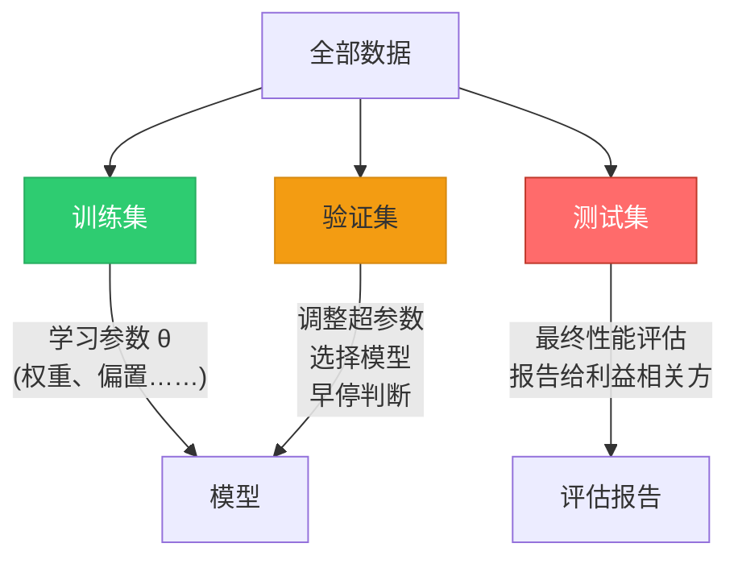
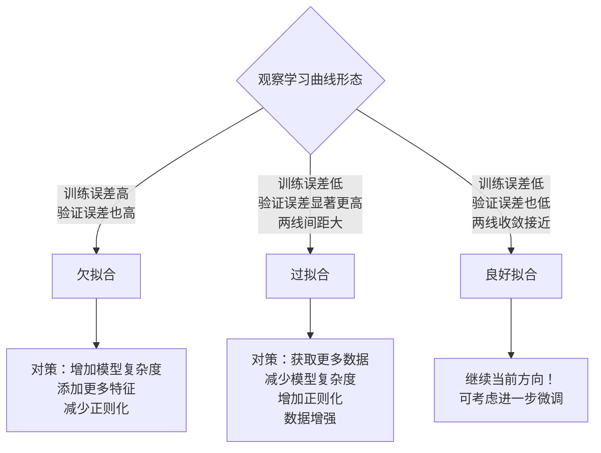

## 为什么需要模型评估？

假设你训练了一个模型，在训练数据上达到了 99.5% 的准确率。这是一个好模型吗？不一定。这个模型可能只是在**背诵**训练数据的答案，而没有任何泛化能力。当你给它一个从未见过的新样本时，它可能完全失效。

这就是模型评估的核心目的：**衡量模型在未见数据上的泛化能力**。

---

## 一、过拟合与欠拟合

### 1.1 过拟合（Overfitting）

**定义：** 模型过度学习了训练数据中的噪声和随机波动，而非底层的真实模式。表现为训练集上表现优秀，但在测试集/新数据上表现很差。

**类比：** 一个学生死记硬背了所有练习题的答案，但当考试题目稍有变化时就无从下手。

**症状：** 训练误差极低 + 验证/测试误差显著较高

**常见原因：**
- 模型过于复杂（参数太多）相对于数据量
- 训练数据太少
- 训练时间过长（神经网络）
- 数据噪声大，模型学到了噪声模式
- 特征中包含不相关的噪声特征

### 1.2 欠拟合（Underfitting）

**定义：** 模型太简单，无法捕捉数据中存在的模式和规律。训练集和测试集上的表现都不好。

**类比：** 一个学生只学了一些基础概念，面对任何稍有难度的题目都做不出来。

**症状：** 训练误差高 + 验证/测试误差也高

**常见原因：**
- 模型太简单（如对非线性数据使用线性模型）
- 特征太少或特征工程不足
- 数据量太大而模型容量不足
- 正则化过度

### 1.3 可视化理解

让我们用一个回归示例来直观感受过拟合和欠拟合：

```python
import numpy as np
import matplotlib.pyplot as plt
from sklearn.linear_model import LinearRegression
from sklearn.preprocessing import PolynomialFeatures
from sklearn.pipeline import Pipeline
from sklearn.metrics import mean_squared_error

# 生成带噪声的二次曲线数据
np.random.seed(42)
X = np.linspace(0, 10, 20).reshape(-1, 1)
y = 2 * X.ravel()**2 - 5 * X.ravel() + 3 + np.random.normal(0, 8, X.shape[0])

# 生成密集的 X 用于绘图
X_plot = np.linspace(0, 10, 200).reshape(-1, 1)

plt.figure(figsize=(15, 4))

degrees = [1, 2, 10]
titles = [
    '欠拟合 (Degree=1)\n模型太简单，无法捕捉曲线趋势',
    '良好拟合 (Degree=2)\n模型复杂度与数据复杂度匹配',
    '过拟合 (Degree=10)\n模型过于复杂，拟合了噪声'
]

for i, degree in enumerate(degrees):
    model = Pipeline([
        ('poly', PolynomialFeatures(degree=degree)),
        ('linear', LinearRegression())
    ])
    model.fit(X, y)
    y_pred = model.predict(X_plot)

    plt.subplot(1, 3, i + 1)
    plt.scatter(X, y, color='blue', s=50, label='训练数据', alpha=0.7)
    plt.plot(X_plot, y_pred, color='red', linewidth=2, label=f'模型(degree={degree})')
    plt.title(titles[i], fontsize=11)
    plt.xlabel('x')
    plt.ylabel('y')

    train_mse = mean_squared_error(y, model.predict(X))
    plt.legend()
    plt.text(0.5, 0.05, f'训练MSE: {train_mse:.1f}', transform=plt.gca().transAxes,
             fontsize=9, ha='center')

plt.tight_layout()
plt.savefig('overfitting_demo.png', dpi=120, bbox_inches='tight')
plt.show()
```

从上图中可以清楚地看到：
- **Degree=1（欠拟合）**：一条直线无法描述数据的曲线形态，训练误差很高
- **Degree=2（恰好）**：模型捕捉到了真实的二次曲线趋势，曲线平滑且贴近数据点
- **Degree=10（过拟合）**：曲线剧烈摆动以精准穿过每个训练点，但这只是噪声的体现

---

## 二、训练/验证/测试划分详解

### 2.1 三者的角色



- **训练集（60-80%）**：用于更新模型参数（$\theta$）。模型直接"看到"并学习这些数据。
- **验证集（10-20%）**：用于**超参数调优**和**模型选择**。模型不会直接在验证集上学习，但你通过调整超参数来优化验证集性能，因此模型间接地"利用"了验证集信息。
- **测试集（10-20%）**：**绝不用于模型开发或超参数调优。** 只在使用最终确定的模型后评估一次，作为泛化性能的客观估计。测试集是模拟"用户将要输入的真实数据"的替身。

### 2.2 典型比例

| 数据总量 | 训练:验证:测试 | 备注 |
|----------|:---:|------|
| < 1,000 | 60:20:20 | 每个集合都要有足够样本代表分布 |
| 1,000 - 10,000 | 70:15:15 | 最常用的比例 |
| 10,000 - 100,000 | 80:10:10 | 验证集和测试集各有几千样本就够了 |
| > 100,000 | 95:2.5:2.5 | 验证和测试各有一两万样本即可 |
| > 1,000,000 | 98:1:1 | 甚至可以更极端 |

### 2.3 交叉验证（Cross-Validation）

当数据量有限时，单次划分可能不稳定（验证性能很大程度取决于运气）。交叉验证通过多次划分取平均来解决这个问题。

**K 折交叉验证：**
1. 将训练数据随机分成 $K$ 个等大的子集（折）
2. 进行 $K$ 轮训练，每轮用 $K-1$ 个折训练，1 个折验证
3. 取 $K$ 轮验证结果的平均值作为最终评估

```python
import numpy as np
from sklearn.model_selection import cross_val_score, KFold
from sklearn.ensemble import RandomForestClassifier
from sklearn.datasets import load_breast_cancer

data = load_breast_cancer()
X, y = data.data, data.target

model = RandomForestClassifier(n_estimators=100, random_state=42)

# 5 折交叉验证
kfold = KFold(n_splits=5, shuffle=True, random_state=42)
cv_scores = cross_val_score(model, X, y, cv=kfold, scoring='accuracy')

print(f"各折准确率: {cv_scores}")
print(f"平均准确率: {cv_scores.mean():.4f}")
print(f"标准差: {cv_scores.std():.4f}")
print(f"95% 置信区间: [{cv_scores.mean() - 2*cv_scores.std():.4f}, "
      f"{cv_scores.mean() + 2*cv_scores.std():.4f}]")
```

**K 值的选择：**
- $K = 5$ 或 $K = 10$ 是最常用的选择
- $K$ 越大，评估越准确，但计算成本也越高
- $K = n$（留一法 LOOCV）：最准确但最昂贵，仅适用于极小数据集
- **分层 K 折（Stratified K-Fold）**：确保每折的类别比例与原始数据一致（对分类问题推荐）

---

## 三、核心评估指标

### 3.1 分类指标

首先定义一个分类结果的四个基础计数——混淆矩阵的四个格子：

|  | 预测为正 | 预测为负 |
|--|:---:|:---:|
| **实际为正** | TP (True Positive)，真阳性 | FN (False Negative)，假阴性 / 漏报 |
| **实际为负** | FP (False Positive)，假阳性 / 虚警 | TN (True Negative)，真阴性 |

**准确率（Accuracy）**：最直观但有时最具欺骗性的指标。

$$\text{Accuracy} = \frac{TP + TN}{TP + TN + FP + FN}$$

在类别极度不平衡时，准确率几乎无用。例如一个罕见病检测中，99.9% 的人没病。如果模型对所有样本都预测"没病"，准确率是 99.9%，但它没有捕获任何一个真正的患者。

**精确率（Precision）**：预测为正的样本中，有多少真的是正类。

$$\text{Precision} = \frac{TP}{TP + FP}$$

"宁缺毋滥"——如果你预测某人是犯罪嫌疑人，你有多少把握？

**召回率（Recall）**：所有真正的正类样本中，有多少被正确找出来了。

$$\text{Recall} = \frac{TP}{TP + FN}$$

"宁错勿漏"——在癌症筛查中，漏掉一个患者比多查几个健康人严重得多。

**F1 分数**：精确率和召回率的调和平均，在两者之间取平衡。

$$\text{F1} = 2 \times \frac{\text{Precision} \times \text{Recall}}{\text{Precision} + \text{Recall}}$$

```python
from sklearn.metrics import (accuracy_score, precision_score,
                               recall_score, f1_score, classification_report,
                               confusion_matrix)
import seaborn as sns
import matplotlib.pyplot as plt
from sklearn.linear_model import LogisticRegression
from sklearn.model_selection import train_test_split
from sklearn.datasets import make_classification

# 生成一个类别稍不平衡的数据集
X, y = make_classification(n_samples=1000, n_features=20,
                           weights=[0.7, 0.3], random_state=42)
X_train, X_test, y_train, y_test = train_test_split(X, y, test_size=0.3, random_state=42)

model = LogisticRegression(max_iter=2000)
model.fit(X_train, y_train)
y_pred = model.predict(X_test)

# 各项指标
print(f"准确率 (Accuracy):  {accuracy_score(y_test, y_pred):.4f}")
print(f"精确率 (Precision): {precision_score(y_test, y_pred):.4f}")
print(f"召回率 (Recall):    {recall_score(y_test, y_pred):.4f}")
print(f"F1 分数:            {f1_score(y_test, y_pred):.4f}")

print(f"\n完整分类报告:")
print(classification_report(y_test, y_pred, target_names=['负类(0)', '正类(1)']))

# 混淆矩阵可视化
cm = confusion_matrix(y_test, y_pred)
plt.figure(figsize=(5, 4))
sns.heatmap(cm, annot=True, fmt='d', cmap='Blues',
            xticklabels=['预测负类', '预测正类'],
            yticklabels=['实际负类', '实际正类'])
plt.title('混淆矩阵')
plt.tight_layout()
plt.savefig('confusion_matrix.png', dpi=100, bbox_inches='tight')
plt.show()
```

### 3.2 回归指标

**均方误差（Mean Squared Error，MSE）：**

$$\text{MSE} = \frac{1}{n}\sum_{i=1}^{n}(\hat{y}_i - y_i)^2$$

- 平方惩罚使得大误差被不成比例地加重（对异常值敏感）
- 单位是原始单位的平方，不够直观

**均方根误差（RMSE）：**

$$\text{RMSE} = \sqrt{\frac{1}{n}\sum_{i=1}^{n}(\hat{y}_i - y_i)^2}$$

- MSE 的平方根，量纲与原始目标一致，更易解释
- 是量纲一致的，你可以说"该模型的预测误差约 ±X 元"

**平均绝对误差（Mean Absolute Error，MAE）：**

$$\text{MAE} = \frac{1}{n}\sum_{i=1}^{n}|\hat{y}_i - y_i|$$

- 对异常值不敏感，所有误差等权对待
- 比 MSE/RMSE 更鲁棒

**R 平方（决定系数，$R^2$）：**

$$R^2 = 1 - \frac{\sum_{i=1}^{n}(y_i - \hat{y}_i)^2}{\sum_{i=1}^{n}(y_i - \bar{y})^2}$$

- 衡量模型解释了多少目标变量的方差
- $R^2 = 1$ 表示完美预测，$R^2 = 0$ 表示和预测均值一样好，$R^2 < 0$ 表示还不如预测均值
- 直观理解："模型消除了百分之多少的预测不确定性"

```python
from sklearn.metrics import mean_squared_error, mean_absolute_error, r2_score
import numpy as np

# 模拟回归预测（以房价预测为例）
np.random.seed(42)
y_true = np.array([150, 200, 250, 300, 350, 400, 450, 500])  # 真实房价（万）
y_pred_good = np.array([145, 210, 240, 310, 340, 410, 460, 490])  # 较好的预测
y_pred_poor = np.array([100, 400, 150, 500, 200, 300, 600, 250])   # 较差的预测

for name, y_pred in [("好模型", y_pred_good), ("差模型", y_pred_poor)]:
    mse = mean_squared_error(y_true, y_pred)
    rmse = np.sqrt(mse)
    mae = mean_absolute_error(y_true, y_pred)
    r2 = r2_score(y_true, y_pred)

    print(f"{name}:")
    print(f"  MSE:  {mse:.1f} (万元²)")
    print(f"  RMSE: {rmse:.1f} 万元")
    print(f"  MAE:  {mae:.1f} 万元")
    print(f"  R²:   {r2:.4f}\n")
```

### 指标选择速查

| 问题类型 | 首选指标 | 注意事项 |
|----------|----------|----------|
| 平衡二分类 | Accuracy, F1 | 简单直接 |
| 不平衡二分类 | Precision, Recall, F1, AUC-ROC | 不能只用 Accuracy |
| 多分类 | Macro F1 / Weighted F1 | 各类别贡献等权或加权 |
| 搜索/推荐 | Precision@K, Recall@K, MAP, NDCG | 位置敏感 |
| 回归（无异常值） | RMSE | 同量纲，可解释 |
| 回归（有异常值） | MAE | 更鲁棒 |
| 模型比较 | R² / Adjusted R² | 衡量方差解释比例 |

---

## 四、学习曲线（Learning Curves）

学习曲线是诊断过拟合和欠拟合的最强大工具之一。它展示了模型性能如何随训练样本数量的增加而变化。

```python
import numpy as np
import matplotlib.pyplot as plt
from sklearn.model_selection import learning_curve
from sklearn.svm import SVC
from sklearn.datasets import load_digits

# 加载数据
digits = load_digits()
X, y = digits.data, digits.target

# 计算学习曲线
train_sizes, train_scores, val_scores = learning_curve(
    SVC(kernel='rbf', gamma=0.001, C=10, random_state=42),
    X, y, cv=5, n_jobs=-1,
    train_sizes=np.linspace(0.1, 1.0, 10),
    scoring='accuracy'
)

# 计算均值与标准差
train_mean = train_scores.mean(axis=1)
train_std = train_scores.std(axis=1)
val_mean = val_scores.mean(axis=1)
val_std = val_scores.std(axis=1)

# 绘图
plt.figure(figsize=(8, 5))
plt.fill_between(train_sizes, train_mean - train_std, train_mean + train_std, alpha=0.2, color='blue')
plt.fill_between(train_sizes, val_mean - val_std, val_mean + val_std, alpha=0.2, color='orange')
plt.plot(train_sizes, train_mean, 'o-', color='blue', label='训练准确率')
plt.plot(train_sizes, val_mean, 'o-', color='orange', label='验证准确率')
plt.xlabel('训练样本数量')
plt.ylabel('准确率')
plt.title('学习曲线：SVM on Digits')
plt.legend(loc='lower right')
plt.grid(True, alpha=0.3)
plt.tight_layout()
plt.savefig('learning_curve.png', dpi=120, bbox_inches='tight')
plt.show()

print("=== 学习曲线解读 ===")
print(f"最终训练准确率: {train_mean[-1]:.4f}")
print(f"最终验证准确率: {val_mean[-1]:.4f}")
print(f"差距: {train_mean[-1] - val_mean[-1]:.4f}")
```

### 学习曲线诊断指南



**关键观察点：**
1. **两线的间距（Gap）**：间距大 = 过拟合（方差高）
2. **两线的整体高低**：两条线都低 = 欠拟合（偏差高）
3. **随样本数增大的趋势**：验证曲线还在上升 = 更多数据可能有帮助

---

## 五、评估策略综合

### 完整的评估流程图

```python
# ============================================
# 完整的模型评估流程
# ============================================
from sklearn.model_selection import (train_test_split, cross_val_score,
                                       StratifiedKFold, learning_curve)
from sklearn.ensemble import GradientBoostingClassifier
from sklearn.metrics import classification_report, confusion_matrix
from sklearn.datasets import load_breast_cancer
import matplotlib.pyplot as plt
import seaborn as sns
import numpy as np

# 1. 准备数据
data = load_breast_cancer()
X, y = data.data, data.target
print(f"数据集: {X.shape[0]} 样本, {X.shape[1]} 特征")
print(f"类别分布: {np.bincount(y)}")

# 2. 划分测试集（严格隔离）
X_train_val, X_test, y_train_val, y_test = train_test_split(
    X, y, test_size=0.15, random_state=42, stratify=y
)

# 3. 在训练+验证集上进行交叉验证
model = GradientBoostingClassifier(n_estimators=100, max_depth=3, random_state=42)
cv = StratifiedKFold(n_splits=5, shuffle=True, random_state=42)
cv_scores = cross_val_score(model, X_train_val, y_train_val, cv=cv, scoring='accuracy')

print(f"\n=== 交叉验证结果 ===")
print(f"各折准确率: {[f'{s:.4f}' for s in cv_scores]}")
print(f"平均: {cv_scores.mean():.4f} ± {cv_scores.std():.4f}")

# 4. 在完整训练验证集上训练最终模型
model.fit(X_train_val, y_train_val)

# 5. 在测试集上最终评估（仅此一次）
y_pred = model.predict(X_test)
print(f"\n=== 测试集最终评估 ===")
print(f"测试准确率: {model.score(X_test, y_test):.4f}")
print(f"\n{classification_report(y_test, y_pred, target_names=data.target_names)}")

# 6. 检查过拟合
train_acc = model.score(X_train_val, y_train_val)
test_acc = model.score(X_test, y_test)
print(f"训练集准确率: {train_acc:.4f}")
print(f"测试集准确率: {test_acc:.4f}")
print(f"过拟合信号(差距 > 5%?): {'是' if train_acc - test_acc > 0.05 else '否'}")
```

## 本节小结

- 训练准确率不代表一切——它可能只是模型背诵能力的体现。泛化能力才是真正的目标。
- 过拟合（训练集好、测试集差）和欠拟合（两边都差）是模型开发中最常见的两类问题。
- 训练/验证/测试三分是评估的基础，测试集应该只在最终阶段使用一次。
- 交叉验证在小数据集上比单次划分更可靠——K=5 或 K=10 是大多数情况的好选择。
- 选择评估指标要结合业务场景："查全"比"查准"更重要的癌症筛查用 Recall，"查准"比"查全"更重要的垃圾邮件过滤用 Precision。
- 学习曲线是诊断模型问题的最直观工具——观察训练和验证曲线之间的 gap 及各自的高低。
- 混淆矩阵让你看清模型在每一种预测上的具体表现，而非一个笼统的数字。
