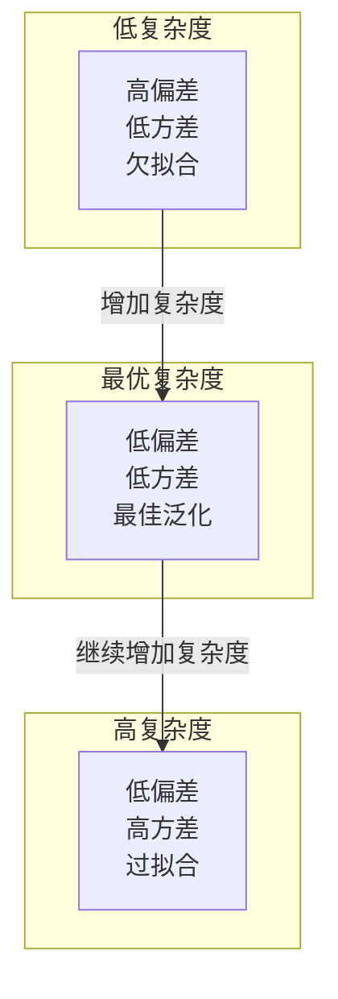
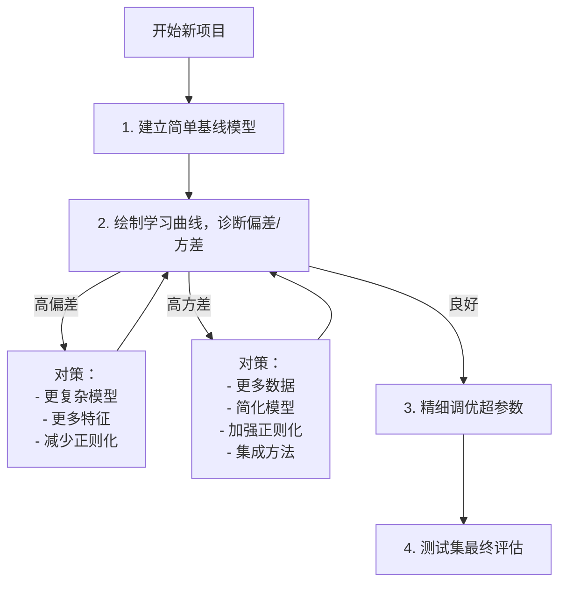

## 偏差-方差权衡：ML 理论的核心

偏差-方差权衡（Bias-Variance Tradeoff）是机器学习理论中最基本、最重要的概念之一。它解释了为什么模型选择不仅仅是"越复杂越好"，也为什么我们需要在欠拟合和过拟合之间寻找平衡。

> 学习机器学习而不理解偏差-方差权衡，就像学物理而不理解能量守恒。

---

## 一、期望泛化误差的数学分解

对于一个给定的输入 $\mathbf{x}$，其真实标签为 $y = f(\mathbf{x}) + \epsilon$，其中 $\epsilon$ 是不可消除的噪声（期望为 0，方差为 $\sigma^2$）。我们训练得到模型 $\hat{f}(\mathbf{x})$。

**期望泛化误差**（Expected Generalization Error）可以分解为三个部分：

$$\mathbb{E}\left[(y - \hat{f}(\mathbf{x}))^2\right] = \underbrace{\left(\mathbb{E}[\hat{f}(\mathbf{x})] - f(\mathbf{x})\right)^2}_{\text{偏差}^2} + \underbrace{\mathbb{E}\left[\left(\hat{f}(\mathbf{x}) - \mathbb{E}[\hat{f}(\mathbf{x})]\right)^2\right]}_{\text{方差}} + \underbrace{\sigma^2}_{\text{不可约误差}}$$

这个公式值得逐项理解。其中 $\mathbb{E}$ 表示对训练数据的抽样分布求期望——想象我们用不同的随机训练集训练出多个模型，然后看它们的预测有多"一致"。

### 1.1 偏差（Bias）

$$\text{Bias}^2 = \left(\mathbb{E}[\hat{f}(\mathbf{x})] - f(\mathbf{x})\right)^2$$

**偏差衡量的是**：即使我们用无穷多个训练集的平均模型，它的预测离真实函数有多远？

- **高偏差**意味着模型的结构性假设与真实模式不匹配。模型"视力模糊"——即使给它海量数据，它也看不清真实规律。
- 这是**系统性误差**，反映了模型的"近视"程度。
- 类比：一个近视的射箭手，即使射很多次，箭的落点中心（平均位置）也偏离靶心——这就是偏差。

**高偏差的场景：**
- 用线性模型拟合明显非线性的数据（如用直线拟合抛物线）
- 模型参数太少，容量不足
- 正则化过强，"惩罚"了模型的学习能力

### 1.2 方差（Variance）

$$\text{Variance} = \mathbb{E}\left[\left(\hat{f}(\mathbf{x}) - \mathbb{E}[\hat{f}(\mathbf{x})]\right)^2\right]$$

**方差衡量的是**：用不同的训练集训练出的模型，它们的预测结果差异有多大？

- **高方差**意味着模型对训练数据的细微变化过度敏感。换一组训练数据，模型给出的预测结果截然不同。
- 这是**不稳定性**，反映了模型"过度反应"的程度。
- 类比：一个视力极好的新手射箭手，每一箭都瞄准了不同的点，箭散落各处——这就是高方差。

**高方差的场景：**
- 深度决策树，深度越大，不同的训练集会生成结构截然不同的树
- 样本量太少，模型"抓住"了噪声
- 高维小样本数据（维度灾难的表现之一）

### 1.3 不可约误差（Irreducible Error）

$$\sigma^2$$

这是问题本身的"噪声天花板"。即使你拥有完美的模型（零偏差、零方差），你仍然无法避免的误差。例如：
- 数据标注本身有噪声（两个标注者对同一张图给出不同标签）
- 测量误差（传感器精度有限）
- 问题本身就存在随机性（掷硬币的结果）

> 贝叶斯最优误差（Bayes Error）就是不可约误差，是任何模型能达到的最好表现的理论上界——但它只是一个理论概念，因为完美的贝叶斯最优分类器在实际中几乎永远不可实现。

---

## 二、偏差-方差权衡（The Tradeoff）



偏差和方差通常是**此消彼长**的关系：

- **简单模型**（如线性回归）：高偏差 + 低方差。模型的假设强，训练数据变来变去模型变化不大，但模型假设可能根本不对。
- **复杂模型**（如深度决策树、大型神经网络）：低偏差 + 高方差。模型足够灵活可以拟合任何模式，但不同训练集会生成差异很大的模型。
- **最优模型**：在偏差和方差之间找到最佳平衡，使总误差最小。

### 模型复杂度与误差的关系

```python
import numpy as np
import matplotlib.pyplot as plt
from sklearn.linear_model import LinearRegression
from sklearn.preprocessing import PolynomialFeatures
from sklearn.pipeline import Pipeline
from sklearn.metrics import mean_squared_error

# 生成数据
np.random.seed(42)
X_all = np.linspace(0, 1, 100).reshape(-1, 1)
true_func = lambda x: np.sin(2 * np.pi * x).ravel()

errors_train = []
errors_test = []

# 模拟多次训练以展示方差效应
n_trials = 50
sample_size = 30
X_plot = np.linspace(0, 1, 200).reshape(-1, 1)
y_plot_true = true_func(X_plot)

degrees = range(1, 16)

# 生成多个训练集
np.random.seed(0)
train_sets = []
for _ in range(n_trials):
    idx = np.random.choice(len(X_all), sample_size, replace=False)  # 不放回抽样
    X_train = X_all[idx]
    y_train = true_func(X_train) + np.random.normal(0, 0.2, sample_size)
    train_sets.append((X_train, y_train))

# 固定测试集
X_test = X_all[~np.isin(np.arange(len(X_all)),
              np.random.choice(len(X_all), sample_size, replace=False))]
y_test = true_func(X_test) + np.random.normal(0, 0.2, len(X_test))

for degree in degrees:
    trial_preds = []
    trial_train_errs = []

    for X_train, y_train in train_sets:
        model = Pipeline([
            ('poly', PolynomialFeatures(degree=degree)),
            ('linear', LinearRegression())
        ])
        model.fit(X_train, y_train)

        y_pred_test = model.predict(X_test)
        y_pred_train = model.predict(X_train)

        trial_preds.append(y_pred_test)
        trial_train_errs.append(mean_squared_error(y_train, y_pred_train))

    # 方差：不同训练集得到的预测之间的方差（在测试集上的平均方差）
    trial_preds = np.array(trial_preds)
    mean_pred = trial_preds.mean(axis=0)
    variance = np.mean(np.var(trial_preds, axis=0))

    # 偏差²：平均预测与真实函数之间的平均平方差
    bias_sq = np.mean((mean_pred - y_test) ** 2)

    # 总测试误差（平均）
    test_error = np.mean([mean_squared_error(y_test, p) for p in trial_preds])

    errors_train.append(np.mean(trial_train_errs))
    errors_test.append(test_error)

# 绘图
fig, (ax1, ax2) = plt.subplots(1, 2, figsize=(14, 5))

# 左图：训练 vs 测试误差
ax1.plot(degrees, errors_train, 'o-', color='blue', label='训练误差', linewidth=2)
ax1.plot(degrees, errors_test, 's-', color='red', label='测试误差', linewidth=2)
ax1.axvline(x=degrees[np.argmin(errors_test)], color='green',
            linestyle='--', label=f'最佳复杂度 degree={degrees[np.argmin(errors_test)]}')
ax1.set_xlabel('模型复杂度（多项式阶数）')
ax1.set_ylabel('均方误差 (MSE)')
ax1.set_title('模型复杂度 vs 误差')
ax1.legend()
ax1.grid(True, alpha=0.3)

# 右图：多个模型的预测曲线（展示方差）
ax2.plot(X_plot, y_plot_true, 'k-', linewidth=2, label='真实函数 f(x)')

# 展示 degree=1（高偏差低方差）
for i in range(5):  # 展示5个模型
    model = Pipeline([
        ('poly', PolynomialFeatures(degree=1)),
        ('linear', LinearRegression())
    ])
    X_train, y_train = train_sets[i]
    model.fit(X_train, y_train)
    y_plot_pred = model.predict(X_plot)
    ax2.plot(X_plot.ravel(), y_plot_pred, 'b-', alpha=0.3, linewidth=0.8)
ax2.plot([], [], 'b-', alpha=0.5, label='Degree=1 (5个模型)')

# 展示 degree=12（低偏差高方差）
colors = plt.cm.Reds(np.linspace(0.4, 0.9, 5))
for i in range(5):
    model = Pipeline([
        ('poly', PolynomialFeatures(degree=12)),
        ('linear', LinearRegression())
    ])
    X_train, y_train = train_sets[i]
    model.fit(X_train, y_train)
    y_plot_pred = model.predict(X_plot)
    ax2.plot(X_plot.ravel(), y_plot_pred, color=colors[i], alpha=0.5, linewidth=0.8)
ax2.plot([], [], 'r-', alpha=0.5, label='Degree=12 (5个模型)')

ax2.set_xlabel('x')
ax2.set_ylabel('y')
ax2.set_title('不同模型复杂度下的预测方差')
ax2.legend()
ax2.grid(True, alpha=0.3)

plt.tight_layout()
plt.savefig('bias_variance_tradeoff.png', dpi=120, bbox_inches='tight')
plt.show()
```

从实验结果中可以清楚地看到：
- **Degree=1**（左图低复杂度区）：多个模型的预测线几乎重合（低方差），但它们离真实曲线很远（高偏差）
- **Degree=12**（左图高复杂度区）：模型几乎完美拟合数据点（低偏差），但不同训练集会生成剧烈波动的曲线（高方差）
- **测试误差**的 U 形曲线清楚展示了最优复杂度点位于中间

---

## 三、学习曲线诊断偏差和方差

学习曲线不仅是评估工具，更是区分偏差问题和方差问题的诊断利器。

```python
import numpy as np
import matplotlib.pyplot as plt
from sklearn.linear_model import LinearRegression
from sklearn.tree import DecisionTreeRegressor
from sklearn.model_selection import learning_curve
from sklearn.metrics import make_scorer, mean_squared_error

# 生成非线性数据
np.random.seed(42)
X = np.random.uniform(-3, 3, 200).reshape(-1, 1)
y = X.ravel()**2 + np.random.normal(0, 1.5, X.shape[0])

fig, axes = plt.subplots(1, 2, figsize=(14, 5))
titles = ['高偏差情况 (欠拟合)\n线性回归拟合非线性数据',
          '高方差情况 (过拟合)\n决策树深度过大']

models = [
    LinearRegression(),
    DecisionTreeRegressor(max_depth=15, random_state=42)
]

for ax, model, title in zip(axes, models, titles):
    train_sizes, train_scores, val_scores = learning_curve(
        model, X, y, cv=5,
        train_sizes=np.linspace(0.1, 1.0, 10),
        scoring=make_scorer(mean_squared_error, greater_is_better=False),
        random_state=42, n_jobs=-1
    )

    # 转回正 MSE
    train_scores = -train_scores
    val_scores = -val_scores

    train_mean = train_scores.mean(axis=1)
    train_std = train_scores.std(axis=1)
    val_mean = val_scores.mean(axis=1)
    val_std = val_scores.std(axis=1)

    ax.fill_between(train_sizes, train_mean - train_std,
                     train_mean + train_std, alpha=0.2, color='blue')
    ax.fill_between(train_sizes, val_mean - val_std,
                     val_mean + val_std, alpha=0.2, color='orange')
    ax.plot(train_sizes, train_mean, 'o-', color='blue', label='训练误差', linewidth=2)
    ax.plot(train_sizes, val_mean, 'o-', color='orange', label='验证误差', linewidth=2)
    ax.set_xlabel('训练样本数量')
    ax.set_ylabel('均方误差 (MSE)')
    ax.set_title(title)
    ax.legend()
    ax.grid(True, alpha=0.3)

    # 添加诊断标注
    final_train = train_mean[-1]
    final_val = val_mean[-1]
    gap = final_val - final_train

    if title.startswith('高偏差'):
        ax.annotate(f'训练误差高: {final_train:.1f}\n验证误差高: {final_val:.1f}\n'
                    f'→ 典型欠拟合',
                    xy=(train_sizes[-1], final_val), xytext=(train_sizes[-4], final_val * 1.5),
                    arrowprops=dict(arrowstyle='->', color='red'),
                    fontsize=9, color='red')
    else:
        ax.annotate(f'训练误差低: {final_train:.2f}\n验证误差高: {final_val:.1f}\n'
                    f'差距: {gap:.1f}\n→ 典型过拟合',
                    xy=(train_sizes[-1], final_val),
                    xytext=(train_sizes[-5], final_val * 1.3),
                    arrowprops=dict(arrowstyle='->', color='red'),
                    fontsize=9, color='red')

plt.tight_layout()
plt.savefig('learning_curve_diagnosis.png', dpi=120, bbox_inches='tight')
plt.show()
```

### 学习曲线诊断表

| 症状 | 训练误差 | 验证误差 | 两线间距 | 诊断 | 治疗方向 |
|------|:---:|:---:|:---:|------|------|
| 两条线都高，收敛在一起 | 高 | 高 | 小 | **高偏差（欠拟合）** | 增加模型复杂度 |
| 训练误差低，验证误差高 | 低 | 高 | 大 | **高方差（过拟合）** | 简化模型 / 增加数据 |
| 两条线都低，收敛在一起 | 低 | 低 | 小 | **良好拟合** | 继续当前方向 |
| 验证误差还在下降趋势中 | - | 下降中 | - | **需要更多数据** | 收集更多数据可能有帮助 |

**对于高偏差（欠拟合）问题的对策：**
- 增加模型复杂度（更多层、更多参数）
- 添加更丰富的特征（特征工程）
- 减少正则化强度（减小 $\lambda$）
- 尝试更灵活的模型类型（树模型换神经网络，线性换非线性）

**对于高方差（过拟合）问题的对策：**
- 收集更多训练数据（最根本的解决方案）
- 降低模型复杂度（减少参数、限制树深度）
- 增加正则化（L1/L2、Dropout、数据增强）
- 集成方法（Bagging 如随机森林）
- 早停（Early Stopping）：在验证误差开始上升时停止训练

---

## 四、正则化：偏差-方差管理的工具

正则化通过在损失函数中引入额外的惩罚项，强制模型保持简单，从而以**增加一点偏差为代价大幅减少方差**。

### 4.1 L1 和 L2 正则化

对于线性模型参数 $\mathbf{w} = [w_1, w_2, \ldots, w_d]$，正则化的损失函数为：

$$\mathcal{L}_{\text{regularized}} = \mathcal{L}_{\text{original}} + \lambda \cdot R(\mathbf{w})$$

- **L2 正则化（Ridge，岭回归）**：$R(\mathbf{w}) = \|\mathbf{w}\|_2^2 = \sum_{j=1}^{d} w_j^2$

  L2 正则化倾向于让所有权重都变小但不为零，就像一个"均匀收缩"的力量。

- **L1 正则化（Lasso）**：$R(\mathbf{w}) = \|\mathbf{w}\|_1 = \sum_{j=1}^{d} |w_j|$

  L1 正则化倾向于产生**稀疏**的解——它会迫使一些权重精确为零，相当于自动做了特征选择。

- **Elastic Net**：结合 L1 和 L2 的优点：$R(\mathbf{w}) = \alpha\|\mathbf{w}\|_1 + (1-\alpha)\|\mathbf{w}\|_2^2$

### 4.2 正则化强度的影响

超参数 $\lambda$（有时记为 $\alpha$ 或 $C = \frac{1}{\lambda}$）控制正则化的强度：

| $\lambda$ 值 | 效果 | 偏差 | 方差 |
|:---:|------|:---:|:---:|
| $\lambda = 0$ | 无正则化，模型可以自由拟合 | 低 | 高 |
| $\lambda$ 小 | 轻微约束 | 较低 | 中等 |
| $\lambda$ 适中 | 良好平衡 | 中等 | 较低 |
| $\lambda$ 过大 | 过度约束，模型几乎变成常数 | 极高 | 极低 |

```python
import numpy as np
import matplotlib.pyplot as plt
from sklearn.linear_model import Ridge
from sklearn.model_selection import cross_val_score
from sklearn.preprocessing import StandardScaler, PolynomialFeatures
from sklearn.pipeline import Pipeline

# 生成小样本、高噪声的数据（容易过拟合的情形）
np.random.seed(42)
n_samples = 30
X = np.random.uniform(-3, 3, n_samples).reshape(-1, 1)
y = X.ravel()**3 - 3 * X.ravel() + np.random.normal(0, 8, n_samples)

# 多项式特征（15阶，容易过拟合）
X_plot = np.linspace(-3.5, 3.5, 300).reshape(-1, 1)
alphas = [1e-5, 0.1, 10, 1000]
titles = ['无正则化 (α=1e-5)\n过拟合', '弱正则化 (α=0.1)',
          '中等正则化 (α=10)\n良好泛化', '强正则化 (α=1000)\n欠拟合']

fig, axes = plt.subplots(2, 2, figsize=(12, 9))
axes = axes.ravel()

for ax, alpha, title in zip(axes, alphas, titles):
    # 训练多个模型来展示方差
    for trial in range(8):
        # 对训练数据加轻微扰动模拟不同训练集
        noise = np.random.normal(0, 1, n_samples)
        y_perturbed = y + noise

        model = Pipeline([
            ('poly', PolynomialFeatures(degree=15)),
            ('scaler', StandardScaler()),
            ('ridge', Ridge(alpha=alpha))
        ])
        model.fit(X, y_perturbed)
        y_plot = model.predict(X_plot)

        if trial == 0:
            ax.plot(X_plot, y_plot, 'r-', alpha=0.4, linewidth=0.8,
                    label=f'{8}个模型的预测')
        else:
            ax.plot(X_plot, y_plot, 'r-', alpha=0.4, linewidth=0.8)

    ax.scatter(X, y, color='blue', s=40, zorder=5, label='训练数据')
    ax.set_title(title)
    ax.set_xlabel('x')
    ax.set_ylabel('y')
    ax.legend(fontsize=8)
    ax.set_ylim(y.min() - 10, y.max() + 10)

    # 计算交叉验证分数
    pipeline = Pipeline([
        ('poly', PolynomialFeatures(degree=15)),
        ('scaler', StandardScaler()),
        ('ridge', Ridge(alpha=alpha))
    ])
    cv_scores = cross_val_score(pipeline, X, y, cv=5,
                                 scoring='neg_mean_squared_error')
    ax.text(0.05, 0.95, f'CV MSE: {-cv_scores.mean():.1f} (±{cv_scores.std():.1f})',
            transform=ax.transAxes, fontsize=9, verticalalignment='top',
            bbox=dict(boxstyle='round', facecolor='wheat', alpha=0.8))

plt.tight_layout()
plt.savefig('regularization_effect.png', dpi=120, bbox_inches='tight')
plt.show()
```

从上图可以看出正则化的魔力：
- 无正则化时，8 个模型的预测曲线在数据稀疏区域剧烈发散（高方差）
- 随着 $\alpha$ 增大，曲线越来越集中（方差降低），但也越来越偏离数据趋势（偏差增加）
- 适中的 $\alpha$ 在偏差和方差之间取得了最好的平衡（CV 分数最好）

---

## 五、寻找最优平衡的实战策略

### 5.1 使用验证集 / 交叉验证系统地搜索

不要凭直觉猜测模型复杂度和正则化强度——用数据驱动的方法：

```python
from sklearn.model_selection import GridSearchCV
from sklearn.ensemble import GradientBoostingRegressor
from sklearn.datasets import fetch_california_housing

data = fetch_california_housing()
X, y = data.data, data.target

model = GradientBoostingRegressor(random_state=42)

param_grid = {
    'n_estimators': [50, 100, 200],         # 树的数量（复杂度）
    'max_depth': [2, 3, 4, 5],               # 树的深度（复杂度）
    'learning_rate': [0.01, 0.05, 0.1],      # 学习率（与n_estimators配合）
    'min_samples_leaf': [5, 10, 20],         # 叶节点最小样本数（正则化）
}

grid = GridSearchCV(model, param_grid, cv=5,
                    scoring='neg_mean_squared_error',
                    n_jobs=-1, verbose=0)
grid.fit(X, y)

print(f"最佳参数: {grid.best_params_}")
print(f"最佳 CV MSE: {-grid.best_score_:.4f}")
print(f"\n最优模型中:")
best = grid.best_estimator_
print(f"  n_estimators={best.n_estimators} - 更多树 → 更低偏差，但可能更高方差")
print(f"  max_depth={best.max_depth} - 更深 → 更低偏差，更高方差")
print(f"  min_samples_leaf={best.min_samples_leaf} - 更大 → 更高偏差，更低方差（正则化效果）")
```

### 5.2 完整策略：循序渐进



### 5.3 偏差-方差管理的实用经验法则

1. **从简单模型开始，逐步增加复杂度**。你总是可以先看到"欠拟合"的样子，然后在不过拟合的前提下逐步提升。
2. **数据是解决方差问题的最优解**。在条件允许时，获取更多高质量数据比调参更有价值。
3. **不要同时调整多个轴**。当试图修复偏差时修改模型复杂度，当试图修复方差时调整正则化。同时改变所有超参数会让你不知道是哪个改变起了作用。
4. **集成方法（Ensemble）是"免费午餐"**：Bagging（如随机森林）主要降低方差，Boosting（如 XGBoost）主要降低偏差。许多现代 ML 比赛的获胜方案都依赖于集成。
5. **深度学习中的"剃刀"**：大型神经网络在偏差-方差权衡上表现出一些反直觉的特性（"双下降"现象）——达到过拟合点之后继续增大模型，测试误差反而可能再次下降。但传统 ML 模型的 U 形曲线仍然适用。

```python
# 同时调优模型复杂度和正则化强度
# 这是绝大多数实际项目的标准做法
from sklearn.model_selection import RandomizedSearchCV
from sklearn.ensemble import RandomForestClassifier
from sklearn.datasets import make_classification
from scipy.stats import randint, uniform

X, y = make_classification(n_samples=2000, n_features=30,
                           n_informative=15, random_state=42)

rf = RandomForestClassifier(random_state=42)

param_dist = {
    'n_estimators': randint(50, 500),        # 控制集成大小
    'max_depth': randint(3, 30),              # 控制单棵树复杂度
    'min_samples_split': randint(2, 20),      # 正则化：分裂所需最小样本
    'min_samples_leaf': randint(1, 15),       # 正则化：叶节点最小样本
    'max_features': uniform(0.3, 0.7),        # 正则化：每次分裂考虑的特征比例
}

random_search = RandomizedSearchCV(
    rf, param_dist, n_iter=50, cv=5,
    scoring='accuracy', n_jobs=-1, random_state=42
)
random_search.fit(X, y)

print(f"最佳参数: {random_search.best_params_}")
print(f"最佳 CV 准确率: {random_search.best_score_:.4f}")

# 分析：哪些参数起着关键作用？
results = random_search.cv_results_
import pandas as pd
df_results = pd.DataFrame(results['params'])
df_results['mean_test_score'] = results['mean_test_score']

# 找出得分最高和最低的参数组合对比
top_idx = results['rank_test_score'] == 1
print(f"\n最优 vs 最差参数的特征对比（用于判断超参数影响方向）")
```

---

## 六、本节小结

- 期望泛化误差可以精确分解为 $\text{Bias}^2 + \text{Variance} + \sigma^2$，偏差是系统性错误，方差是不稳定性，噪声是不可逾越的天花板。
- 偏差-方差权衡是贯穿 ML 模型选择的根本原理：简单模型高偏差低方差，复杂模型低偏差高方差，目标是找到泛化误差最小的平衡点。
- 学习曲线是诊断偏差/方差问题的第一工具——观察训练和验证曲线的水平和间距即可判断问题类型。
- 高偏差（欠拟合）用更复杂模型、更多特征来修复；高方差（过拟合）用更多数据、正则化、简化模型来修复。
- 正则化（L1/L2/Elastic Net）以增加少量偏差为代价换取大幅方差降低，是控制过拟合的核心手段。
- 实践中使用交叉验证 + 网格/随机搜索来系统性地寻找最优的偏差-方差平衡点。
- 集成方法中，Bagging 主要降低方差，Boosting 主要降低偏差——理解这一点有助于正确选择模型。

偏差-方差权衡不仅是理论基础——它是你在每次训练模型、选择算法、调整超参数时，脑海中进行决策的内在框架。掌握了它，你就理解了机器学习优化的本质。
